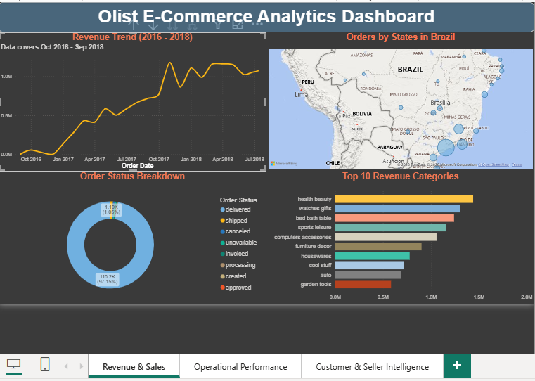
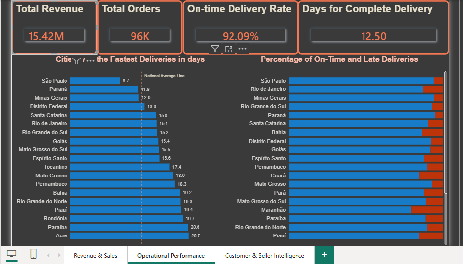
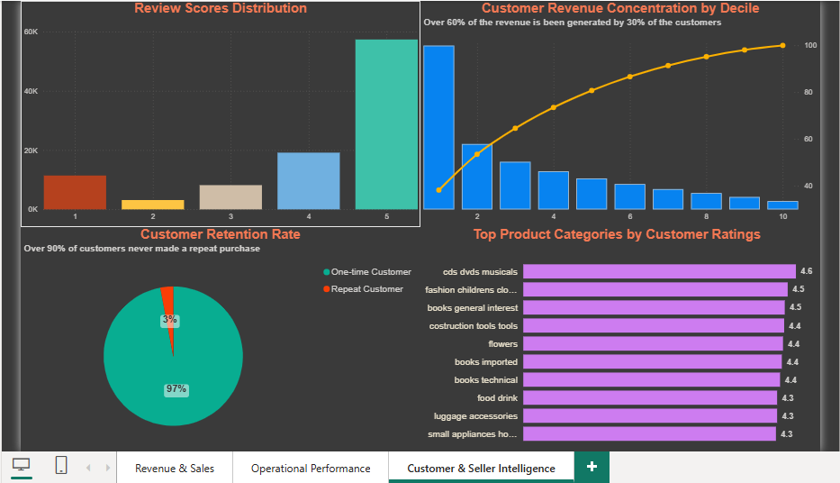

# Olist Brazilian E-Commerce Analytics



## Overview
An end-to-end data analytics project built on the [Olist Brazilian E-Commerce dataset](https://www.kaggle.com/datasets/olistbr/brazilian-ecommerce) — a real-world dataset of 100,000+ orders placed on Brazil's largest department store marketplace between 2016 and 2018.

This project demonstrates a full analytics engineering workflow: raw data ingestion, relational data modelling, SQL analysis, and multi-page business intelligence reporting across three analytical dimensions — revenue, operations, and customer intelligence.

---

## Tools & Technologies
| Tool | Purpose |
|------|---------|
| PostgreSQL 16 | Database and data warehouse |
| DBeaver | SQL client and database management |
| Python (pandas, SQLAlchemy) | Data ingestion from CSV to PostgreSQL |
| Power BI Desktop | 3-page interactive dashboard |
| Git & GitHub | Version control and portfolio hosting |

---

## Project Architecture

```
Raw CSVs (9 files, 500k+ rows)
      ↓
PostgreSQL raw schema (as-is data)
      ↓
PostgreSQL marts schema (star schema + analytical tables)
      ↓
Power BI 3-Page Dashboard
```

### Star Schema
- **fact_orders** — core fact table linking orders, customers, sellers and products
- **dim_customers** — customer location data
- **dim_products** — product categories and dimensions
- **dim_sellers** — seller location data

---

## Dashboard Pages

### Page 1 — Revenue & Sales

- Monthly revenue trend (Oct 2016 – Sep 2018)
- Orders by Brazilian state (bubble map)
- Top 10 revenue categories
- Order status breakdown

### Page 2 — Operational Performance

- KPI cards: Total Revenue, Total Orders, On-Time Delivery Rate, Avg Delivery Days
- Delivery speed by state with national average reference line
- On-time vs late delivery breakdown by state

### Page 3 — Customer & Seller Intelligence

- Customer revenue concentration (Pareto analysis)
- Customer retention rate
- Review score distribution
- Top product categories by customer rating

---

## Key Findings

### Revenue Growth
- Olist grew from near zero in late 2016 to over **R$1M per month** by 2018
- A significant revenue spike occurred in **November 2017**, consistent with Black Friday seasonal demand
- Total revenue across the period: **R$15.42M**

### Top Product Categories (by Revenue)
| Category | Revenue (BRL) |
|----------|--------------|
| Health & Beauty | R$1,412,089 |
| Watches & Gifts | R$1,264,333 |
| Bed, Bath & Table | R$1,225,209 |
| Sports & Leisure | R$1,118,256 |
| Computers & Accessories | R$1,032,723 |

### Geographic Distribution
- **São Paulo** accounts for 40,500+ orders — more than 3x any other state
- The Southeast region (SP, RJ, MG) drives the majority of all revenue

### Operational Performance
- **92.09% of orders delivered on time**
- São Paulo has the fastest average delivery at **8.7 days**
- Acre has the slowest at **20.7 days** — reflecting geographic distance from distribution hubs
- National average delivery time: **12.5 days**

### Customer Intelligence
- **97% of customers never made a repeat purchase** — indicating a significant retention challenge
- The **top 30% of customers drive 65% of total revenue** (Pareto principle confirmed in real data)
- Most customers rate Olist positively — the majority of reviews are 5 stars
- Top rated product categories maintain above 4.2 average review scores

---

## How to Reproduce

### 1. Clone the repo
```bash
git clone https://github.com/agucharles91-cpu/olist-ecommerce-analytics.git
```

### 2. Download the dataset
Download the 9 CSV files from [Kaggle](https://www.kaggle.com/datasets/olistbr/brazilian-ecommerce) and place them in `data/raw/`

### 3. Set up PostgreSQL
Create a database called `olist_ecommerce` in PostgreSQL 16.

### 4. Load the data
```bash
pip install pandas sqlalchemy psycopg2-binary
python python/load_to_postgres.py
```

### 5. Run the SQL scripts
Run the scripts in the `sql/` folder in order:
1. `04_marts/` — creates the star schema tables
2. `05_analysis/` — creates analytical tables for the dashboard

### 6. Open the dashboard
Open `powerbi/olist_dashboard.pbix` in Power BI Desktop and refresh the data connection pointing to your local PostgreSQL instance.

---

## Project Structure
```
olist-ecommerce-analytics/
├── README.md
├── data/
│   └── raw/                    # CSV files (not tracked in git)
├── sql/
│   ├── 04_marts/               # Star schema creation
│   └── 05_analysis/            # Analytical tables for dashboard
├── python/
│   └── load_to_postgres.py     # Data ingestion script
├── powerbi/
│   └── olist_dashboard.pbix    # 3-page Power BI dashboard
└── docs/
    ├── Olist_page1.png         # Revenue & Sales
    ├── Olist_page2.png         # Operational Performance
    └── Olist_page3.png         # Customer & Seller Intelligence
```

---

## Author
**Agu Charles Chibuike**
MSc Data Science — University of Nairobi
[GitHub](https://github.com/agucharles91-cpu) · [Portfolio](https://agucharles91-cpu.github.io)
