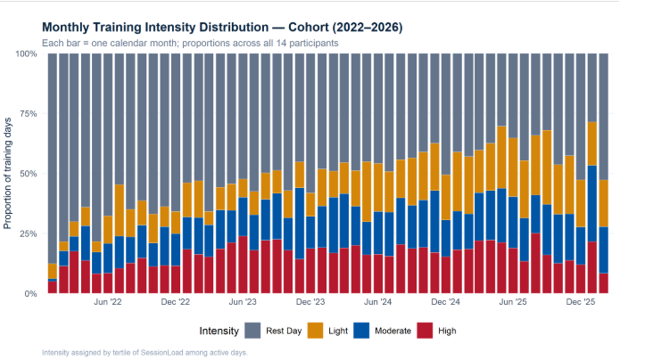
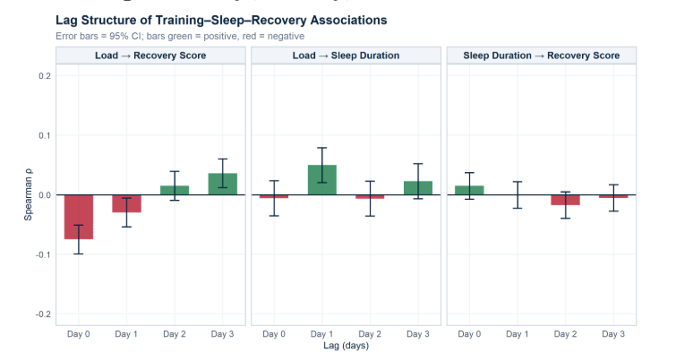
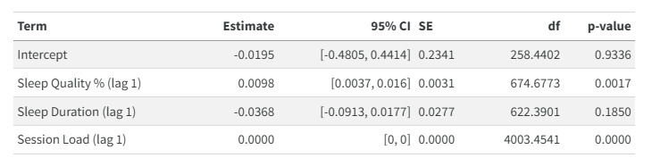

```{=html}
<style>
/* =========================================================
   AGU CHARLES CHIBUIKE — CASE STUDY
   Scientific Data Science / AqSolDB
   ========================================================= */


/* =========================================================
   DESIGN TOKENS
   ========================================================= */

:root {
  --navy: #0D1B2A;
  --navy-2: #14263A;
  --teal: #00A878;
  --teal-dark: #008A65;
  --gold: #E8C547;

  --ink: #1A1A2E;
  --slate: #4A5568;
  --muted: #718096;

  --mist: #F7F6F2;
  --white: #FFFFFF;
  --border: #E2E0DA;

  --display: "Space Grotesk", sans-serif;
  --serif: "Source Serif 4", Georgia, serif;
  --mono: "JetBrains Mono", monospace;

  --content-width: 1180px;
  --text-width: 760px;
}


/* =========================================================
   GLOBAL RESET
   ========================================================= */

*,
*::before,
*::after {
  box-sizing: border-box;
}

html {
  scroll-behavior: smooth;
}

body {
  margin: 0;
  padding: 0;
  background: var(--white);
  color: var(--ink);
  font-family: var(--serif);
  font-size: 17px;
  line-height: 1.7;
}

body,
.quarto-container,
#quarto-content,
main {
  max-width: none !important;
}

main {
  margin: 0 !important;
  padding: 0 !important;
}

p {
  margin: 0 0 20px;
}

a {
  color: inherit;
}

strong {
  font-weight: 600;
}

::selection {
  background: rgba(0,168,120,0.18);
}


/* =========================================================
   HIDE QUARTO DEFAULT CHROME
   ========================================================= */

#quarto-header,
.navbar,
.sidebar,
.sidebar-navigation,
.quarto-title-block,
.quarto-title-banner,
#TOC {
  display: none !important;
}


/* =========================================================
   NAVIGATION
   ========================================================= */

.case-nav {
  background: var(--navy);
  border-bottom: 1px solid rgba(255,255,255,0.09);
}

.case-nav-inner {
  width: min(var(--content-width), calc(100% - 48px));
  margin: 0 auto;

  min-height: 76px;

  display: flex;
  align-items: center;
  justify-content: space-between;
}

.case-nav-back,
.case-nav-brand {
  font-family: var(--mono);
  font-size: 10px;
  letter-spacing: 0.08em;
  text-transform: uppercase;
}

.case-nav-back {
  color: rgba(255,255,255,0.65);
  text-decoration: none;

  transition: color 0.2s ease;
}

.case-nav-back:hover {
  color: var(--teal);
}

.case-nav-brand {
  color: var(--white);
  font-weight: 500;
}


/* =========================================================
   HERO
   ========================================================= */

.case-hero {
  background: var(--navy);
  color: var(--white);

  padding: 105px 0 100px;

  position: relative;
  overflow: hidden;
}

.case-hero::after {
  content: "";

  position: absolute;
  width: 340px;
  height: 340px;

  right: -120px;
  bottom: -180px;

  border: 1px solid rgba(0,168,120,0.16);
  border-radius: 50%;

  pointer-events: none;
}

.case-hero-inner {
  width: min(var(--content-width), calc(100% - 48px));
  margin: 0 auto;

  max-width: 900px;
  margin-left: max(24px, calc((100% - var(--content-width)) / 2));
}

.case-kicker {
  font-family: var(--mono);
  font-size: 10px;
  letter-spacing: 0.18em;
  color: var(--teal);
  text-transform: uppercase;

  margin-bottom: 25px;
}

.case-title {
  font-family: var(--display);
  font-size: clamp(52px, 7vw, 88px);
  font-weight: 600;
  line-height: 0.98;
  letter-spacing: -0.045em;

  margin: 0 0 32px;

  color: var(--white);
}

.case-subtitle {
  max-width: 730px;

  font-family: var(--serif);
  font-size: 22px;
  line-height: 1.55;

  color: #CBD5E0;

  margin-bottom: 34px;
}

.case-meta {
  display: flex;
  flex-wrap: wrap;
  gap: 8px;

  margin-bottom: 34px;
}

.case-meta span {
  font-family: var(--mono);
  font-size: 9px;
  letter-spacing: 0.07em;
  text-transform: uppercase;

  color: var(--teal);

  border: 1px solid rgba(0,168,120,0.3);
  background: rgba(0,168,120,0.07);

  padding: 7px 10px;
  border-radius: 2px;
}


/* =========================================================
   BUTTONS / LINKS
   ========================================================= */

.case-links {
  display: flex;
  flex-wrap: wrap;
  gap: 12px;
}

.case-btn {
  display: inline-flex;
  align-items: center;
  justify-content: center;

  min-height: 44px;
  padding: 11px 17px;

  font-family: var(--mono);
  font-size: 10px;
  letter-spacing: 0.06em;
  text-transform: uppercase;

  text-decoration: none;

  border-radius: 3px;

  transition:
    background 0.2s ease,
    color 0.2s ease,
    border-color 0.2s ease,
    transform 0.2s ease;
}

.case-btn:hover {
  transform: translateY(-2px);
}

.case-btn-primary {
  background: var(--teal);
  color: var(--navy);

  border: 1px solid var(--teal);
}

.case-btn-primary:hover {
  background: #08B985;
  color: var(--navy);
}

.case-btn-secondary {
  color: var(--ink);
  background: transparent;

  border: 1px solid var(--border);
}

.case-btn-secondary:hover {
  border-color: var(--teal);
  color: var(--teal-dark);
}


/* =========================================================
   STATS STRIP
   ========================================================= */

.stats-strip {
  display: grid;
  grid-template-columns: repeat(4, 1fr);

  border-bottom: 1px solid var(--border);
  background: var(--mist);
}

.stat {
  min-height: 145px;

  padding: 30px 28px;

  display: flex;
  flex-direction: column;
  justify-content: center;

  border-right: 1px solid var(--border);
}

.stat:last-child {
  border-right: none;
}

.stat-value {
  font-family: var(--display);
  font-size: 34px;
  font-weight: 600;
  line-height: 1;

  color: var(--navy);

  margin-bottom: 10px;
}

.stat-label {
  font-family: var(--mono);
  font-size: 9px;
  line-height: 1.5;
  letter-spacing: 0.08em;

  color: var(--muted);
  text-transform: uppercase;
}


/* =========================================================
   GENERAL SECTION
   ========================================================= */

.case-section {
  width: min(var(--content-width), calc(100% - 48px));
  margin: 0 auto;

  padding-top: 105px;
  padding-bottom: 105px;
}

.case-section-num {
  font-family: var(--mono);
  font-size: 10px;
  letter-spacing: 0.16em;

  color: var(--teal);
  text-transform: uppercase;

  margin-bottom: 22px;
}

.case-section-title {
  max-width: 850px;

  font-family: var(--display);
  font-size: clamp(34px, 4vw, 52px);
  font-weight: 600;
  line-height: 1.1;
  letter-spacing: -0.025em;

  color: var(--ink);

  margin: 0 0 28px;
}

.section-intro {
  max-width: var(--text-width);

  font-family: var(--serif);
  font-size: 18px;
  color: var(--slate);

  margin-bottom: 38px;
}


/* =========================================================
   INTRO / QUESTION
   ========================================================= */

.case-intro {
  width: min(var(--content-width), calc(100% - 48px));
  margin: 0 auto;

  padding: 105px 0;
}

.case-two-column {
  display: grid;
  grid-template-columns: minmax(280px, 0.85fr) minmax(320px, 1.15fr);
  gap: 90px;
  align-items: start;
}

.case-two-column h2 {
  font-family: var(--display);
  font-size: clamp(34px, 4vw, 50px);
  font-weight: 600;
  line-height: 1.1;
  letter-spacing: -0.03em;

  color: var(--ink);

  margin: 0;
}

.case-two-column p {
  max-width: 700px;
  color: var(--slate);
}

.case-two-column .lead {
  font-size: 20px;
  line-height: 1.6;
  color: var(--ink);
}


/* =========================================================
   DARK SECTIONS
   ========================================================= */

.dark-section {
  background: var(--navy);
  color: var(--white);
}

.section-title-light {
  max-width: 850px;

  font-family: var(--display);
  font-size: clamp(34px, 4vw, 52px);
  font-weight: 600;
  line-height: 1.1;
  letter-spacing: -0.03em;

  color: var(--white);

  margin: 0 0 45px;
}


/* =========================================================
   DATA CARDS
   ========================================================= */

.data-grid {
  display: grid;
  grid-template-columns: repeat(3, 1fr);
  gap: 16px;

  margin-top: 42px;
}

.data-card {
  padding: 30px;

  min-height: 235px;

  border: 1px solid rgba(255,255,255,0.1);
  border-radius: 5px;

  background: rgba(255,255,255,0.035);
}

.data-number {
  font-family: var(--display);
  font-size: 38px;
  font-weight: 600;
  line-height: 1;

  color: var(--teal);

  margin-bottom: 18px;
}

.data-heading {
  font-family: var(--display);
  font-size: 18px;
  font-weight: 600;

  color: var(--white);

  margin-bottom: 10px;
}

.data-card p {
  font-size: 15px;
  line-height: 1.6;

  color: #A0AEC0;

  margin: 0;
}

.source-note {
  margin-top: 28px;

  font-family: var(--mono);
  font-size: 9px;
  line-height: 1.7;

  color: #718096;

  text-transform: uppercase;
  letter-spacing: 0.04em;
}

.source-note strong {
  color: #A0AEC0;
}


/* =========================================================
   PIPELINE
   ========================================================= */

.pipeline {
  display: flex;
  align-items: stretch;

  margin-top: 48px;

  overflow-x: auto;

  padding-bottom: 8px;
}

.pipeline-step {
  flex: 1;
  min-width: 145px;

  padding: 22px 18px;

  border: 1px solid var(--border);
  background: var(--mist);

  display: flex;
  align-items: center;
  gap: 14px;
}

.pipeline-number {
  width: 30px;
  height: 30px;

  flex: 0 0 30px;

  display: flex;
  align-items: center;
  justify-content: center;

  border-radius: 50%;

  background: var(--navy);
  color: var(--teal);

  font-family: var(--mono);
  font-size: 9px;
}

.pipeline-step strong {
  display: block;

  font-family: var(--display);
  font-size: 13px;
  font-weight: 600;

  color: var(--ink);

  margin-bottom: 3px;
}

.pipeline-step span {
  display: block;

  font-family: var(--mono);
  font-size: 8px;
  letter-spacing: 0.04em;

  color: var(--muted);
}

.pipeline-arrow {
  flex: 0 0 auto;

  display: flex;
  align-items: center;
  justify-content: center;

  width: 30px;

  font-family: var(--mono);
  font-size: 14px;

  color: var(--teal);
}


/* =========================================================
   SPLIT SECTIONS
   ========================================================= */

.split-section {
  display: grid;
  grid-template-columns: minmax(0, 1.35fr) minmax(280px, 0.65fr);

  gap: 80px;

  width: min(var(--content-width), calc(100% - 48px));
  margin: 0 auto;

  padding: 105px 0;
}

.split-content h2 {
  max-width: 760px;

  font-family: var(--display);
  font-size: clamp(36px, 4vw, 54px);
  font-weight: 600;
  line-height: 1.08;
  letter-spacing: -0.03em;

  color: var(--ink);

  margin: 0 0 30px;
}

.split-content > p {
  max-width: 720px;
  color: var(--slate);
}

.split-aside {
  display: flex;
  align-items: flex-start;
  justify-content: flex-end;
}


/* =========================================================
   METHOD CALLOUT
   ========================================================= */

.method-callout {
  margin-top: 34px;
  padding: 22px 24px;

  border-left: 3px solid var(--teal);

  background: var(--mist);

  display: flex;
  flex-direction: column;
  gap: 7px;
}

.method-callout strong {
  font-family: var(--mono);
  font-size: 9px;
  letter-spacing: 0.1em;
  text-transform: uppercase;

  color: var(--teal-dark);
}

.method-callout span {
  font-family: var(--serif);
  font-size: 16px;
  line-height: 1.55;

  color: var(--slate);
}


/* =========================================================
   METHOD CARD
   ========================================================= */

.method-card {
  width: 100%;
  max-width: 340px;

  padding: 32px;

  background: var(--navy);

  border-radius: 5px;

  box-shadow: 8px 8px 0 var(--teal);
}

.method-label {
  font-family: var(--mono);
  font-size: 9px;
  letter-spacing: 0.12em;

  color: var(--teal);

  text-transform: uppercase;

  margin-bottom: 18px;
}

.method-big {
  font-family: var(--display);
  font-size: 56px;
  font-weight: 600;
  line-height: 1;

  color: var(--white);

  margin-bottom: 18px;
}

.method-card p {
  font-size: 15px;
  line-height: 1.6;

  color: #A0AEC0;

  margin: 0;
}


/* =========================================================
   RESULTS
   ========================================================= */

.results-section {
  background: var(--mist);

  border-top: 1px solid var(--border);
  border-bottom: 1px solid var(--border);
}

.result-grid {
  display: grid;
  grid-template-columns: repeat(3, 1fr);
  gap: 16px;

  margin-top: 45px;
}

.result-card {
  padding: 30px;

  min-height: 210px;

  background: var(--white);

  border: 1px solid var(--border);
  border-radius: 5px;
}

.result-primary {
  border-top: 3px solid var(--teal);
}

.result-label {
  font-family: var(--mono);
  font-size: 9px;
  letter-spacing: 0.1em;

  color: var(--muted);

  text-transform: uppercase;

  margin-bottom: 28px;
}

.result-number {
  font-family: var(--display);
  font-size: 50px;
  font-weight: 600;
  line-height: 1;

  color: var(--navy);

  margin-bottom: 9px;
}

.result-caption {
  font-family: var(--mono);
  font-size: 9px;
  letter-spacing: 0.08em;

  color: var(--teal-dark);

  text-transform: uppercase;
}


/* =========================================================
   CHART PLACEHOLDERS
   ========================================================= */

.chart-placeholder {
  min-height: 330px;

  margin-top: 42px;

  display: flex;
  flex-direction: column;
  align-items: center;
  justify-content: center;

  text-align: center;

  border: 1px dashed #C8C6BF;
  background: rgba(255,255,255,0.5);

  padding: 40px;
}

.chart-placeholder-label {
  font-family: var(--mono);
  font-size: 9px;
  letter-spacing: 0.14em;

  color: var(--teal-dark);

  text-transform: uppercase;

  margin-bottom: 12px;
}

.chart-placeholder p {
  max-width: 500px;

  font-family: var(--serif);
  font-size: 15px;

  color: var(--muted);

  margin: 0;
}

.chart-dark {
  border-color: rgba(255,255,255,0.15);
  background: rgba(255,255,255,0.035);
}

.chart-dark .chart-placeholder-label {
  color: var(--teal);
}

.chart-dark p {
  color: #718096;
}


/* =========================================================
   FINDINGS
   ========================================================= */

.finding-layout {
  display: grid;
  grid-template-columns: 0.8fr 1.2fr;
  gap: 60px;
  align-items: center;
}

.finding-stat {
  font-family: var(--display);
  font-size: clamp(64px, 8vw, 100px);
  font-weight: 600;
  line-height: 0.95;

  color: var(--teal);

  margin-bottom: 15px;
}

.finding-heading {
  font-family: var(--display);
  font-size: 25px;
  font-weight: 600;

  color: var(--white);

  margin-bottom: 18px;
}

.finding-main p {
  max-width: 520px;

  color: #A0AEC0;
}

.calibration-callout {
  width: 100%;
  box-sizing: border-box;
  margin-top: 42px;
}

/* =========================================================
   APPLICABILITY DOMAIN
   ========================================================= */

.ad-stat-grid {
  display: grid;
  grid-template-columns: repeat(2, 1fr);

  gap: 12px;

  margin-top: 35px;
}

.ad-stat-grid > div {
  padding: 20px;

  background: var(--mist);
  border: 1px solid var(--border);

  display: flex;
  flex-direction: column;
}

.ad-stat-grid strong {
  font-family: var(--display);
  font-size: 30px;
  line-height: 1;

  color: var(--teal-dark);

  margin-bottom: 8px;
}

.ad-stat-grid span {
  font-family: var(--mono);
  font-size: 9px;
  letter-spacing: 0.08em;

  color: var(--ink);

  text-transform: uppercase;

  margin-bottom: 7px;
}

.ad-stat-grid small {
  font-family: var(--serif);
  font-size: 12px;
  line-height: 1.45;

  color: var(--muted);
}


/* =========================================================
   EXPLAINABILITY
   ========================================================= */

.explain-grid {
  display: grid;
  grid-template-columns: 0.85fr 1.15fr;

  gap: 75px;

  align-items: center;
}

.lead-light {
  font-family: var(--serif);
  font-size: 22px;
  line-height: 1.55;

  color: var(--white);
}

.light-text {
  color: #A0AEC0;
}

.explain-grid strong {
  color: var(--white);
}


/* =========================================================
   WHAT I BUILT
   ========================================================= */

.build-grid {
  display: grid;
  grid-template-columns: repeat(2, 1fr);

  gap: 16px;

  margin-top: 45px;
}

.build-card {
  padding: 30px;

  border: 1px solid var(--border);
  border-radius: 5px;

  background: var(--white);
}

.build-number {
  font-family: var(--mono);
  font-size: 10px;
  letter-spacing: 0.1em;

  color: var(--teal);

  margin-bottom: 22px;
}

.build-card h3 {
  font-family: var(--display);
  font-size: 21px;
  font-weight: 600;

  color: var(--ink);

  margin: 0 0 10px;
}

.build-card p {
  font-size: 15px;
  line-height: 1.6;

  color: var(--slate);

  margin: 0;
}


/* =========================================================
   LIMITATIONS
   ========================================================= */

.limitations {
  margin: 0;
  padding: 0;

  list-style: none;

  max-width: 760px;
}

.limitations li {
  position: relative;

  padding: 0 0 20px 28px;
  margin-bottom: 20px;

  border-bottom: 1px solid var(--border);

  color: var(--slate);
}

.limitations li::before {
  content: "—";

  position: absolute;
  left: 0;
  top: 0;

  color: var(--teal);

  font-family: var(--mono);
}

.limitation-note {
  width: 100%;
  max-width: 340px;

  padding: 30px;

  background: var(--mist);

  border-left: 3px solid var(--gold);
}

.limitation-note p {
  font-family: var(--serif);
  font-size: 19px;
  line-height: 1.5;

  color: var(--ink);

  margin: 0;
}


/* =========================================================
   EVIDENCE
   ========================================================= */

.evidence-section {
  background: var(--mist);

  border-top: 1px solid var(--border);
}

.evidence-section h2 {
  font-family: var(--display);
  font-size: clamp(36px, 4vw, 54px);
  font-weight: 600;
  line-height: 1.1;
  letter-spacing: -0.03em;

  color: var(--ink);

  margin: 0 0 25px;
}

.evidence-section p {
  max-width: 680px;

  color: var(--slate);

  margin-bottom: 30px;
}


/* =========================================================
   FOOTER
   ========================================================= */

.case-footer {
  min-height: 100px;

  padding: 30px max(24px, calc((100% - var(--content-width)) / 2));

  display: flex;
  align-items: center;
  justify-content: space-between;

  background: var(--navy);

  color: rgba(255,255,255,0.6);

  font-family: var(--mono);
  font-size: 9px;
  letter-spacing: 0.08em;
  text-transform: uppercase;
}

.case-footer a {
  color: rgba(255,255,255,0.6);
  text-decoration: none;

  transition: color 0.2s ease;
}

.case-footer a:hover {
  color: var(--teal);
}


/* =========================================================
   RESPONSIVE — TABLET
   ========================================================= */

@media (max-width: 900px) {

  .case-hero {
    padding: 85px 0 80px;
  }

  .case-title {
    font-size: clamp(48px, 9vw, 72px);
  }

  .case-two-column,
  .finding-layout,
  .explain-grid {
    grid-template-columns: 1fr;
    gap: 45px;
  }

  .split-section {
    grid-template-columns: 1fr;
    gap: 45px;
  }

  .split-aside {
    justify-content: flex-start;
  }

  .method-card,
  .limitation-note {
    max-width: none;
  }

  .data-grid {
    grid-template-columns: 1fr;
  }

  .result-grid {
    grid-template-columns: 1fr;
  }

  .build-grid {
    grid-template-columns: 1fr;
  }

  .stats-strip {
    grid-template-columns: repeat(2, 1fr);
  }

  .stat:nth-child(2) {
    border-right: none;
  }

  .stat:nth-child(-n+2) {
    border-bottom: 1px solid var(--border);
  }

  .stat:nth-child(3) {
    border-right: 1px solid var(--border);
  }
}


/* =========================================================
   RESPONSIVE — MOBILE
   ========================================================= */

@media (max-width: 650px) {

  body {
    font-size: 16px;
  }

  .case-nav-inner,
  .case-hero-inner,
  .case-section,
  .case-intro {
    width: calc(100% - 36px);
  }

  .case-nav-inner {
    min-height: 64px;
  }

  .case-nav-brand {
    display: none;
  }

  .case-hero {
    padding: 65px 0 65px;
  }

  .case-kicker {
    font-size: 9px;
    margin-bottom: 20px;
  }

  .case-title {
    font-size: clamp(44px, 13vw, 60px);
    margin-bottom: 25px;
  }

  .case-subtitle {
    font-size: 18px;
  }

  .case-meta {
    gap: 6px;
  }

  .case-meta span {
    font-size: 8px;
    padding: 6px 8px;
  }

  .case-section,
  .case-intro,
  .split-section {
    padding-top: 72px;
    padding-bottom: 72px;
  }

  .case-two-column h2,
  .split-content h2,
  .case-section-title,
  .section-title-light {
    font-size: 34px;
  }

  .case-two-column {
    gap: 30px;
  }

  .case-two-column .lead {
    font-size: 18px;
  }

  .stats-strip {
    grid-template-columns: 1fr 1fr;
  }

  .stat {
    min-height: 125px;
    padding: 22px 18px;
  }

  .stat-value {
    font-size: 29px;
  }

  .stat-label {
    font-size: 8px;
  }

  .pipeline {
    display: grid;
    grid-template-columns: 1fr;
    gap: 8px;
  }

  .pipeline-step {
    min-width: 0;
  }

  .pipeline-arrow {
    width: auto;
    height: 18px;
    transform: rotate(90deg);
  }

  .finding-stat {
    font-size: 72px;
  }

  .ad-stat-grid {
    grid-template-columns: 1fr;
  }

  .chart-placeholder {
    min-height: 250px;
    padding: 25px;
  }

  .case-links {
    flex-direction: column;
    align-items: stretch;
  }

  .case-btn {
    width: 100%;
  }

  .case-footer {
    min-height: 120px;

    padding: 28px 18px;

    align-items: flex-start;

    flex-direction: column;
    gap: 18px;
  }
}


/* =========================================================
   ACCESSIBILITY
   ========================================================= */

@media (prefers-reduced-motion: reduce) {

  html {
    scroll-behavior: auto;
  }

  *,
  *::before,
  *::after {
    transition: none !important;
  }
}


/* =========================================================
   EXTENDED SECTIONS — generic .section wrapper
   (used by validation-section, ad-section)
   ========================================================= */

.section {
  width: 100%;
  background: var(--white);
}

.section-inner {
  width: min(var(--content-width), calc(100% - 48px));
  margin: 0 auto;

  padding-top: 105px;
  padding-bottom: 105px;
}

.section-kicker {
  font-family: var(--mono);
  font-size: 10px;
  letter-spacing: 0.16em;

  color: var(--teal);
  text-transform: uppercase;

  margin-bottom: 22px;
}

.section-heading {
  max-width: 850px;
  margin-bottom: 48px;
}

.section-heading h2 {
  font-family: var(--display);
  font-size: clamp(34px, 4vw, 52px);
  font-weight: 600;
  line-height: 1.1;
  letter-spacing: -0.025em;

  color: var(--ink);

  margin: 0 0 22px;
}

.section-lead {
  font-family: var(--serif);
  font-size: 19px;
  line-height: 1.6;

  color: var(--slate);

  margin: 0;
}

/* =========================================================
   TWO COLUMN (generic — used within .section)
   ========================================================= */

.two-column {
  display: grid;
  grid-template-columns: 1fr 1fr;
  gap: 60px;

  margin-bottom: 60px;
}

.two-column .column h3 {
  font-family: var(--display);
  font-size: 20px;
  font-weight: 600;

  color: var(--ink);

  margin: 0 0 16px;
}

.two-column .column p {
  color: var(--slate);
  max-width: 520px;
}

.two-column.ad-explanation {
  margin-top: 50px;
  margin-bottom: 0;
}

/* Method card variant used inline in a two-column layout
   (distinct usage from the split-section .method-card, but
   shares the same dark card treatment) */

.two-column .method-card {
  max-width: none;
  box-shadow: none;
  border: 1px solid rgba(255,255,255,0.08);
}

.two-column .method-card .method-number {
  width: 34px;
  height: 34px;

  display: flex;
  align-items: center;
  justify-content: center;

  border-radius: 50%;

  background: var(--teal);
  color: var(--navy);

  font-family: var(--mono);
  font-size: 12px;
  font-weight: 600;

  margin-bottom: 20px;
}

.two-column .method-card h3 {
  color: var(--white);
  margin-bottom: 14px;
}

.two-column .method-card p {
  color: #A0AEC0;
  font-size: 15px;
  line-height: 1.6;
  max-width: none;
  margin-bottom: 14px;
}

.two-column .method-card p:last-child {
  margin-bottom: 0;
}

.interpretation-card {
  height: 100%;

  padding: 32px;

  background: var(--mist);
  border: 1px solid var(--border);
  border-radius: 5px;
}

.interpretation-card h3 {
  font-family: var(--display);
  font-size: 18px;
  font-weight: 600;

  color: var(--ink);

  margin: 0 0 14px;
}

.interpretation-card p {
  font-size: 15px;
  line-height: 1.6;

  color: var(--slate);
}

.interpretation-card p:last-child {
  margin-bottom: 0;
}

/* =========================================================
   VALIDATION PROCESS STEPS
   ========================================================= */

.validation-process {
  display: grid;
  grid-template-columns: repeat(4, 1fr);
  gap: 16px;

  margin-bottom: 60px;
}

.validation-step {
  display: flex;
  flex-direction: column;
  gap: 14px;

  padding: 26px 22px;

  background: var(--mist);
  border: 1px solid var(--border);
  border-radius: 5px;
}

.validation-step .step-label {
  width: 30px;
  height: 30px;

  display: flex;
  align-items: center;
  justify-content: center;

  border-radius: 50%;

  background: var(--navy);
  color: var(--teal);

  font-family: var(--mono);
  font-size: 9px;
}

.validation-step h4 {
  font-family: var(--display);
  font-size: 15px;
  font-weight: 600;

  color: var(--ink);

  margin: 0;
}

.validation-step p {
  font-size: 14px;
  line-height: 1.55;

  color: var(--slate);

  margin: 0;
}

/* =========================================================
   VALIDATION RESULT
   ========================================================= */

.validation-result {
  display: grid;
  grid-template-columns: 1.3fr 0.9fr;
  gap: 50px;

  padding: 46px;

  background: var(--navy);
  border-radius: 6px;

  margin-bottom: 46px;
}

.result-kicker {
  font-family: var(--mono);
  font-size: 9px;
  letter-spacing: 0.12em;

  color: var(--teal);
  text-transform: uppercase;

  margin-bottom: 16px;
}

.result-copy h3 {
  font-family: var(--display);
  font-size: 26px;
  font-weight: 600;

  color: var(--white);

  margin: 0 0 18px;
}

.result-copy p {
  color: #A0AEC0;
  max-width: 560px;
}

.result-callout {
  display: flex;
  flex-direction: column;
  justify-content: center;
  align-items: flex-start;
  gap: 12px;

  border-left: 3px solid var(--teal);
  padding-left: 26px;
}

.callout-number {
  font-family: var(--display);
  font-size: 44px;
  font-weight: 600;
  line-height: 1;

  color: var(--teal);
}

.callout-label {
  font-family: var(--serif);
  font-size: 14px;
  line-height: 1.5;

  color: #A0AEC0;
}

/* =========================================================
   SECTION ASIDE (callout box, light variant of method-callout)
   ========================================================= */

.section-aside {
  padding: 26px 28px;

  border-left: 3px solid var(--gold);
  background: var(--mist);

  display: flex;
  flex-direction: column;
  gap: 10px;
}

.section-aside strong {
  font-family: var(--mono);
  font-size: 9px;
  letter-spacing: 0.1em;
  text-transform: uppercase;

  color: var(--ink);
}

.section-aside p {
  font-family: var(--serif);
  font-size: 15px;
  line-height: 1.6;

  color: var(--slate);

  margin: 0;
}

.section-aside p + p {
  margin-top: 12px;
}

/* =========================================================
   APPLICABILITY DOMAIN RESULTS
   ========================================================= */

.ad-results {
  display: grid;
  grid-template-columns: repeat(2, 1fr);
  gap: 16px;

  margin-bottom: 20px;
}

.ad-result {
  display: flex;
  flex-direction: column;
  gap: 10px;

  padding: 30px 26px;

  background: var(--navy);
  border-radius: 5px;
}

.ad-value {
  font-family: var(--display);
  font-size: 42px;
  font-weight: 600;
  line-height: 1;

  color: var(--teal);
}

.ad-label {
  font-family: var(--serif);
  font-size: 14px;
  line-height: 1.5;

  color: #A0AEC0;
}

/* =========================================================
   TECHNICAL SAFEGUARD
   ========================================================= */

.technical-safeguard {
  margin-top: 50px;
  padding: 34px 36px;

  background: var(--mist);
  border: 1px solid var(--border);
  border-radius: 5px;
}

.safeguard-label {
  font-family: var(--mono);
  font-size: 9px;
  letter-spacing: 0.12em;
  text-transform: uppercase;

  color: var(--teal-dark);

  margin-bottom: 16px;
}

.technical-safeguard h3 {
  font-family: var(--display);
  font-size: 20px;
  font-weight: 600;

  color: var(--ink);

  margin: 0 0 14px;
}

.technical-safeguard p {
  color: var(--slate);
  max-width: 760px;
}

.technical-safeguard p:last-child {
  margin-bottom: 0;
}

/* =========================================================
   RESPONSIVE — new section types
   ========================================================= */

@media (max-width: 900px) {

  .two-column,
  .validation-process,
  .validation-result,
  .ad-results {
    grid-template-columns: 1fr;
    gap: 24px;
  }

  .result-callout {
    border-left: none;
    border-top: 3px solid var(--teal);
    padding-left: 0;
    padding-top: 20px;
  }

  .validation-result {
    padding: 34px 26px;
  }

  .technical-safeguard {
    padding: 28px 24px;
  }
}


/* =========================================================
   SIMPLE DATA TABLE (cohort comparison, etc.)
   ========================================================= */

.case-table-wrap {
  margin-top: 32px;
  overflow-x: auto;
}

.case-table {
  width: 100%;
  border-collapse: collapse;

  font-family: var(--serif);
  font-size: 15px;
}

.case-table th,
.case-table td {
  padding: 16px 20px;
  text-align: left;

  border-bottom: 1px solid rgba(255,255,255,0.12);
}

.case-table th {
  font-family: var(--mono);
  font-size: 9px;
  letter-spacing: 0.08em;
  text-transform: uppercase;

  color: var(--teal);
}

.case-table td {
  color: #CBD5E0;
}

.case-table tr:last-child td {
  border-bottom: none;
}

/* light-background variant */
.case-table.light th,
.case-table.light td {
  border-bottom: 1px solid var(--border);
}

.case-table.light th {
  color: var(--teal-dark);
}

.case-table.light td {
  color: var(--slate);
}
</style>
```

```{=html}
<nav class="case-nav">
  <div class="case-nav-inner">
    <a class="case-nav-back" href="/#projects">← All Projects</a>
    <div class="case-nav-brand">AC / DATA</div>
  </div>
</nav>


<section class="case-hero">
  <div class="case-hero-inner">

    <div class="case-kicker">APPLIED DATA SCIENCE · SPORTS ANALYTICS</div>

    <h1 class="case-title">
      Nairobi Runners:<br>
      Training, Sleep &amp; Recovery
    </h1>

    <p class="case-subtitle">
      What happens to recovery after a runner trains hard today?
    </p>

    <p class="case-subtitle" style="font-size:18px;color:#A0AEC0;">
      I analysed more than 12,700 participant-days of Garmin data from 14
      recreational runners in Nairobi, covering training, sleep, heart
      rate and recovery from January 2022 to February 2026. Rather than
      treating each day as an independent observation, I examined how
      these measures changed <strong style="color:#CBD5E0;">within the same
      runner over time</strong> — including what happened in the days
      following training.
    </p>

    <div class="case-meta">
      <span>R 4.5.1</span>
      <span>Shiny</span>
      <span>lme4 / lmerTest</span>
      <span>mgcv</span>
      <span>Quarto</span>
      <span>renv</span>
    </div>

    <div class="case-links">
      <a
        class="case-btn case-btn-primary"
        href="https://github.com/agucharles91-cpu/Nairobi-Runners"
        target="_blank"
        rel="noopener noreferrer">
        View GitHub Repository
      </a>
      <a
        class="case-btn case-btn-secondary"
        href="reports/nairobi-runners-report.html"
        target="_blank"
        rel="noopener noreferrer"
        style="color:#fff;border-color:rgba(255,255,255,0.3);">
        Read Full Report
      </a>
      <a
        class="case-btn case-btn-secondary"
        href="https://agucharles.shinyapps.io/nairobi-runners"
        target="_blank"
        rel="noopener noreferrer"
        style="color:#fff;border-color:rgba(255,255,255,0.3);">
        Open Live Dashboard
      </a>
    </div>

  </div>
</section>


<section class="stats-strip">

  <div class="stat">
    <div class="stat-value">14</div>
    <div class="stat-label">Recreational runners</div>
  </div>

  <div class="stat">
    <div class="stat-value">~12,760</div>
    <div class="stat-label">Participant-days of data</div>
  </div>

  <div class="stat">
    <div class="stat-value">4+ yrs</div>
    <div class="stat-label">Jan 2022 – Feb 2026</div>
  </div>

  <div class="stat">
    <div class="stat-value">Day 0–3</div>
    <div class="stat-label">Lagged relationship window</div>
  </div>

</section>


<section class="case-intro">

  <div class="case-section-num">01 — THE QUESTION</div>

  <div class="case-two-column">

    <div>
      <h2>
        Timing matters more than
        a single correlation
      </h2>
    </div>

    <div>
      <p class="lead">
        Wearable devices generate large amounts of longitudinal data, but
        the interesting question is not simply whether two variables are
        correlated. A demanding training session may not be reflected in
        recovery immediately. Sleep may influence how a runner feels the
        following morning. And these relationships may differ
        substantially between individuals.
      </p>

      <p>
        I focused the analysis around three questions: how does training
        behaviour vary over time, what happens in the days following
        training, and which sleep measures are most closely associated
        with next-day recovery — <strong>sleep duration</strong> or
        <strong>sleep quality</strong>?
      </p>

      <p>
        The analysis was primarily descriptive and longitudinal, with an
        emphasis on <strong>within-person patterns</strong> rather than
        broad population-level inference: what are runners doing, what
        happens afterward, and which variables matter most.
      </p>
    </div>

  </div>

</section>


<section class="dark-section">

  <div class="case-section">

    <div class="case-section-num">02 — THE DATA</div>

    <h2 class="section-title-light">
      Deciding what could be
      compared meaningfully
    </h2>

    <div class="data-grid">

      <div class="data-card">
        <div class="data-number">14</div>
        <div class="data-heading">Recreational runners</div>
        <p>
          Garmin-tracked participants in Nairobi, covering training
          duration/distance/session load, heart rate, sleep, Body Battery,
          respiration, VO₂max and daily activity.
        </p>
      </div>

      <div class="data-card">
        <div class="data-number">~12,760</div>
        <div class="data-heading">Participant-days</div>
        <p>
          Each row is one participant on one calendar day. Because the
          data were collected continuously in natural settings, the
          challenge was deciding which measurements could be compared
          meaningfully.
        </p>
      </div>

      <div class="data-card">
        <div class="data-number">4</div>
        <div class="data-heading">Derived signals</div>
        <p>
          Recovery Score, Sleep Quality %, Session Intensity and Running
          Economy — created to turn raw Garmin measurements into
          analytical variables suited to longitudinal comparison.
        </p>
      </div>

    </div>

    <div class="two-column" style="margin-top:8px;">

      <div class="column">
        <h3 style="color:#fff;">Recovery Score</h3>
        <p style="color:#A0AEC0;">
          A within-person recovery <strong style="color:#fff;">proxy</strong>
          based on the difference between a runner's daily resting heart
          rate and their own 7-day rolling mean. Higher values indicate a
          lower-than-usual resting heart rate relative to that runner's
          recent baseline.
        </p>
        <h3 style="color:#fff;margin-top:22px;">Sleep Quality %</h3>
        <p style="color:#A0AEC0;">
          The proportion of recorded sleep represented by deep and REM
          sleep, used here as a <strong style="color:#fff;">study-specific
          sleep composition metric</strong>. Values above 75% were
          excluded as likely device artefacts.
        </p>
      </div>

      <div class="column">
        <h3 style="color:#fff;">Session Intensity</h3>
        <p style="color:#A0AEC0;">
          Training sessions were classified as Light, Moderate or High
          using data-derived tertile thresholds.
        </p>
        <h3 style="color:#fff;margin-top:22px;">Running Economy</h3>
        <p style="color:#A0AEC0;">
          Average running speed divided by average heart rate, used as a
          descriptive efficiency measure.
        </p>
      </div>

    </div>

    <div class="source-note">
      <strong>Source:</strong> Garmin wearable exports · 1 Jan 2022 – 14 Feb 2026
    </div>

    <div class="case-table-wrap">
      <table class="case-table">
        <thead>
          <tr>
            <th>Coverage gap</th>
            <th>Extent</th>
            <th>Handling</th>
          </tr>
        </thead>
        <tbody>
          <tr>
            <td>Sleep-stage data</td>
            <td>Restricted to 11 of 14 participants</td>
            <td>Separate sleep-staging cohort maintained</td>
          </tr>
          <tr>
            <td>Body Battery</td>
            <td>Unavailable for 1 participant</td>
            <td>Excluded from Body Battery analyses</td>
          </tr>
          <tr>
            <td>VO₂max</td>
            <td>~2.6% residual missingness</td>
            <td>Last-observation-carried-forward imputation</td>
          </tr>
        </tbody>
      </table>
    </div>

    <div class="method-callout" style="margin-top:32px;background:rgba(255,255,255,0.035);border-left-color:var(--gold);">
      <strong style="color:var(--gold);">Why this matters</strong>
      <span style="color:#A0AEC0;">
        These differences were retained in the analytical design rather
        than silently treating the dataset as complete — missingness
        changes what can legitimately be analysed.
      </span>
    </div>

  </div>

</section>


<section class="case-section">

  <div class="case-section-num">03 — FROM WEARABLE DATA TO EVIDENCE</div>

  <h2 class="case-section-title">
    Progressively more targeted analyses,
    not a single statistical technique
  </h2>

  <p class="section-intro">
    The emphasis throughout was on association and temporal structure, not
    causal inference.
  </p>

  <div class="pipeline">

    <div class="pipeline-step">
      <div class="pipeline-number">01</div>
      <div>
        <strong>Describe</strong>
        <span>Distributions & trajectories</span>
      </div>
    </div>

    <div class="pipeline-arrow">→</div>

    <div class="pipeline-step">
      <div class="pipeline-number">02</div>
      <div>
        <strong>Correlate</strong>
        <span>Spearman, same-day</span>
      </div>
    </div>

    <div class="pipeline-arrow">→</div>

    <div class="pipeline-step">
      <div class="pipeline-number">03</div>
      <div>
        <strong>Introduce time</strong>
        <span>Lag Day 0–3, within participant</span>
      </div>
    </div>

    <div class="pipeline-arrow">→</div>

    <div class="pipeline-step">
      <div class="pipeline-number">04</div>
      <div>
        <strong>Account for baselines</strong>
        <span>Mixed-effects, random intercept</span>
      </div>
    </div>

  </div>

  <p style="max-width:720px;margin-top:38px;color:var(--slate);">
    This progression matters because a same-day correlation cannot
    distinguish between an immediate relationship and one that emerges
    later — and a cohort-level average cannot distinguish a universal
    effect from one runner's baseline.
  </p>

</section>


<section class="dark-section">

  <div class="case-section">

    <div class="case-section-num">04 — TRAINING LOAD OVER TIME</div>

    <h2 class="section-title-light">
      Training was highly uneven
      across the observation period
    </h2>

    <div class="finding-layout">

      <div class="finding-main">

        <div class="finding-heading">
          This dataset contains training cycles, not independent daily
          observations
        </div>

        <p>
          Rest and light-training days consistently accounted for roughly
          65–75% of observed days, while moderate and high-load days
          became more prominent in particular training blocks.
        </p>

        <p>
          Session load was strongly right-skewed: most active days sat
          below 20,000 AU, with a long upper tail extending toward the
          dataset's 65,000 AU cap. Longer runs also tended to occur at
          lower relative intensity, with most high-distance sessions below
          90% relative intensity.
        </p>

        <p>
          The point is not to prove a particular training philosophy — it
          establishes the temporal structure and variability that the
          later lag and mixed-effects analyses need to account for.
        </p>
      </div>

      <figure class="chart-placeholder chart-dark" style="max-width:560px;margin:auto;">
        
        <figcaption class="chart-placeholder-label">
          SESSION LOAD DISTRIBUTION
        </figcaption>
      </figure>

    </div>

  </div>

</section>


<section class="case-section">

  <div class="case-section-num">05 — TRAINING &amp; SLEEP</div>

  <h2 class="case-section-title">
    Related, but not simply
  </h2>

  <div class="case-two-column">

    <div>
      <p class="lead">
        <strong>Harder training → worse sleep</strong> is too simple an
        interpretation of what the data show.
      </p>
    </div>

    <div>
      <p>
        Training intensity was associated with differences in subsequent
        sleep measures, but the relationship was not monotonic. High- and
        light-intensity days were associated with greater reductions in
        next-night sleep duration than moderate-intensity days, relative
        to rest. Sleep efficiency showed a different pattern, while sleep
        architecture and fragmentation showed little consistent
        relationship with training intensity.
      </p>

      <p>
        The observed relationships depended on <strong>which sleep
        measure was considered and when it was measured</strong> — which
        led to the more important question this project was built to
        answer: do these relationships appear immediately, or do they
        change across the following days?
      </p>
    </div>

  </div>

</section>


<!-- ============================================================
     06 — LAGGED ANALYSIS (CENTERPIECE)
     ============================================================ -->

<section class="section validation-section" id="lag-analysis">
  <div class="section-inner">

    <div class="section-kicker">06 — THE CENTRAL ANALYSIS</div>

    <div class="section-heading">
      <h2>Recovery is not just a same-day measurement</h2>
      <p class="section-lead">
        A same-day relationship can miss the actual timeline of recovery.
        To examine this, training and sleep measures were shifted forward
        by one, two and three days within each participant. The pattern
        changed with time.
      </p>
    </div>

    <div class="validation-process">

      <div class="validation-step">
        <span class="step-label">D0–1</span>
        <div>
          <h4>Training → Recovery (early)</h4>
          <p>
            Higher Session Load was associated with lower Recovery Score
            on Day 0 and Day 1.
          </p>
        </div>
      </div>

      <div class="validation-step">
        <span class="step-label">D2–3</span>
        <div>
          <h4>Training → Recovery (later)</h4>
          <p>
            By Day 2 the observed association changed direction, with the
            largest positive association occurring on Day 3 of the
            examined window.
          </p>
        </div>
      </div>

      <div class="validation-step">
        <span class="step-label">TL→S</span>
        <div>
          <h4>Training → Sleep</h4>
          <p>
            Negatively associated with sleep duration same-day, followed
            by a stronger positive association on Day 1 and smaller
            positive associations on Days 2–3.
          </p>
        </div>
      </div>

      <div class="validation-step">
        <span class="step-label">S→R</span>
        <div>
          <h4>Sleep → Recovery</h4>
          <p>
            Positive same-day relationship with Recovery Score, but the
            direction became negative on subsequent lag days.
          </p>
        </div>
      </div>

    </div>

    <figure class="chart-placeholder" style="max-width:820px;margin:42px auto 0;">
      
      <figcaption class="chart-placeholder-label">
        LAGGED ASSOCIATION WITH RECOVERY SCORE, DAY 0–3
      </figcaption>
    </figure>

    <div class="validation-result">

      <div class="result-copy">
        <div class="result-kicker">WHAT THE LAG WINDOW SHOWS</div>

        <h3>The relationship is temporally structured, not instantaneous.</h3>

        <p>
          This does <strong>not</strong> establish that hard training
          causes a three-day recovery response. But it shows why looking
          only at contemporaneous correlations would have provided an
          incomplete picture — each of these relationships is an
          observational pattern, not evidence of a biological mechanism.
        </p>
      </div>

      <div class="result-callout">
        <span class="callout-number">D0 → D3</span>
        <span class="callout-label">
          Training Load–Recovery association flips from negative to
          positive across the four-day lag window
        </span>
      </div>

    </div>

    <div class="section-aside">
      <strong>Interpretation boundary</strong>
      <p>
        The lagged analysis identifies temporal associations within the
        observed data. It does not establish how long physiological
        recovery takes, or that training caused the observed changes.
      </p>
    </div>

  </div>
</section>


<section class="results-section">

  <div class="case-section">

    <div class="case-section-num">07 — MIXED-EFFECTS MODEL</div>

    <h2 class="case-section-title">
      Sleep quality carried more signal
      than sleep duration
    </h2>

    <p class="section-intro">
      The lagged analysis showed that timing mattered. The next question
      was whether sleep measures were associated with next-day recovery
      <strong>after accounting for differences between runners</strong>.
      I fitted a mixed-effects model:
    </p>

    <div class="method-callout" style="margin-bottom:38px;">
      <strong>The model</strong>
      <span style="font-family:var(--mono);font-size:14px;">
        Recovery Score ~ Sleep Quality % + Sleep Duration + Session Load + (1 | Participant)
      </span>
    </div>

    <p class="section-intro">
      The random intercept lets each runner have their own baseline
      Recovery Score, rather than assuming every participant starts from
      the same physiological level.
    </p>

    <div class="result-grid">

      <div class="result-card result-primary">
        <div class="result-label">SLEEP QUALITY %</div>
        <div class="result-number" style="font-size:38px;">+0.0098 / pt</div>
        <div class="result-caption">95% CI [0.0037, 0.0160] · p = 0.0017</div>
      </div>

      <div class="result-card">
        <div class="result-label">SLEEP DURATION</div>
        <div class="result-number" style="font-size:38px;">β ≈ −0.037</div>
        <div class="result-caption">95% CI [−0.091, 0.018] · p = 0.185</div>
      </div>

      <div class="result-card">
        <div class="result-label">SESSION LOAD (LAGGED)</div>
        <div class="result-number" style="font-size:38px;">≈ 0</div>
        <div class="result-caption">Significant, not practically meaningful</div>
      </div>

    </div>

    <figure class="chart-placeholder" style="max-width:720px;margin:42px auto 0;">
      
      <figcaption class="chart-placeholder-label">
        MODEL COEFFICIENTS &amp; 95% CONFIDENCE INTERVALS
      </figcaption>
    </figure>

    <div class="method-callout" style="margin-top:42px;">
      <strong>Interpretation</strong>
      <span>
        Sleep Quality % was positively associated with next-day Recovery
        Score (β = 0.0098, 95% CI 0.0037–0.0160, p = 0.0017), while Sleep
        Duration was not statistically significant.
      </span>
    </div>

    <div class="method-callout" style="margin-top:24px;">
      <strong>What this does not mean</strong>
      <span>
        This does not show that increasing sleep quality will cause a
        corresponding improvement in physiological recovery. Recovery
        Score is itself a wearable-derived proxy, and the study is
        observational. Session Load's near-zero coefficient despite
        statistical significance is a useful reminder that significance
        and practical magnitude are different things.
      </span>
    </div>

  </div>

</section>


<section class="dark-section">

  <div class="case-section">

    <div class="case-section-num">08 — INDIVIDUAL DIFFERENCES</div>

    <h2 class="section-title-light">
      Individual differences
      were substantial
    </h2>

    <div class="explain-grid">

      <div>

        <p class="lead-light">
          Cohort-level summaries hide substantial variation between
          runners.
        </p>

        <p class="light-text">
          Participants differed in their baseline Recovery Scores, sleep
          variability, training distributions and longitudinal
          trajectories. Some runners showed relatively stable recovery
          patterns, while others experienced longer periods of positive
          or negative deviation from their own baseline.
        </p>

        <p class="light-text">
          The analysis therefore prioritised <strong>within-person
          comparisons</strong> wherever possible. The model can identify
          relationships between changes in a runner's sleep, training and
          recovery, but the small sample does not justify treating those
          relationships as universal effects for recreational runners.
        </p>

      </div>

      <div class="interpretation-card" style="background:rgba(255,255,255,0.035);border-color:rgba(255,255,255,0.1);">
        <h3 style="color:#fff;">Positioning</h3>
        <p style="color:#A0AEC0;">
          The project is better viewed as a <strong style="color:#fff;">longitudinal
          analytical framework for understanding individual patterns</strong>
          than as a population-level predictive model.
        </p>
      </div>

    </div>

  </div>

</section>


<section class="case-section">

  <div class="case-section-num">09 — WHAT I BUILT</div>

  <h2 class="case-section-title">
    A reproducible workflow, not
    an analysis notebook
  </h2>

  <p class="section-intro">
    raw wearable data → validated transformations → longitudinal analysis
    → statistical modelling → interactive dashboard → reproducible report
  </p>

  <div class="build-grid">

    <div class="build-card">
      <div class="build-number">01</div>
      <h3>Interactive R Shiny dashboard</h3>
      <p>
        Interactive views across training behaviour, sleep and circadian
        patterns, recovery, cross-domain relationships and individual
        trajectories, with global filters by date and sex.
      </p>
    </div>

    <div class="build-card">
      <div class="build-number">02</div>
      <h3>Reproducible analytical report</h3>
      <p>
        A Quarto report documents the complete analytical workflow,
        including data preparation, derived variables, statistical
        analysis and figures.
      </p>
    </div>

    <div class="build-card">
      <div class="build-number">03</div>
      <h3>Reproducible project environment</h3>
      <p>
        <code>renv</code> for dependency management and Git/GitHub for
        version control, so results depend on a defined environment
        rather than an undocumented setup.
      </p>
    </div>

    <div class="build-card">
      <div class="build-number">04</div>
      <h3>Automated testing</h3>
      <p>
        15 automated tests (<code>testthat</code>) covering key
        analytical components of the pipeline.
      </p>
    </div>

  </div>

  <div class="source-note" style="margin-top:38px;">
    <strong>Stack:</strong> R · Shiny · Quarto · tidyverse · ggplot2 · plotly · lme4 · lmerTest · mgcv · renv · testthat
  </div>

</section>


<section class="split-section">

  <div class="split-content">

    <div class="case-section-num">10 — WHAT THE ANALYSIS SUPPORTS</div>

    <h2>
      Three conclusions,
      stated carefully
    </h2>

    <ul class="limitations">

      <li>
        <strong>Timing matters.</strong> Relationships between training,
        sleep and recovery changed across the days following an
        observation — same-day correlations provide only part of the
        picture.
      </li>

      <li>
        <strong>Sleep quality showed more signal than sleep
        duration.</strong> Sleep Quality % showed the clearest
        statistically supported association with next-day Recovery Score
        in the mixed-effects model, while Sleep Duration was not
        statistically significant.
      </li>

      <li>
        <strong>Individual baselines matter.</strong> Runners differed
        substantially in their normal training, sleep and recovery
        patterns, making within-person analysis more informative than
        relying only on cohort averages.
      </li>

    </ul>

  </div>

  <div class="split-aside">

    <div class="limitation-note">
      <div class="method-label">SCOPE</div>
      <p>
        These findings make wearable data useful for monitoring individual
        patterns and generating hypotheses — they do not establish causal
        effects or clinical thresholds.
      </p>
    </div>

  </div>

</section>


<section class="case-section">

  <div class="case-section-num">11 — WHAT THE DATA CANNOT TELL US</div>

  <h2 class="case-section-title">
    Boundaries, stated plainly
  </h2>

  <div class="data-grid" style="margin-top:12px;">

    <div class="data-card" style="background:var(--mist);border:1px solid var(--border);">
      <div class="data-heading" style="color:var(--ink);">Small cohort</div>
      <p style="color:var(--slate);">
        Only 14 runners were available, limiting statistical power and
        making between-person comparisons exploratory.
      </p>
    </div>

    <div class="data-card" style="background:var(--mist);border:1px solid var(--border);">
      <div class="data-heading" style="color:var(--ink);">Wearable measurements</div>
      <p style="color:var(--slate);">
        Garmin-derived sleep, recovery and physiological measures are
        consumer-device estimates rather than laboratory measurements.
      </p>
    </div>

    <div class="data-card" style="background:var(--mist);border:1px solid var(--border);">
      <div class="data-heading" style="color:var(--ink);">Recovery is a proxy</div>
      <p style="color:var(--slate);">
        Derived from resting heart rate relative to an individual's
        rolling baseline. HRV or laboratory measures would provide a more
        direct physiological assessment.
      </p>
    </div>

    <div class="data-card" style="background:var(--mist);border:1px solid var(--border);">
      <div class="data-heading" style="color:var(--ink);">Uneven coverage</div>
      <p style="color:var(--slate);">
        Sleep staging was unavailable for three participants, and Body
        Battery coverage was incomplete.
      </p>
    </div>

    <div class="data-card" style="background:var(--mist);border:1px solid var(--border);">
      <div class="data-heading" style="color:var(--ink);">Imputation</div>
      <p style="color:var(--slate);">
        VO₂max contains last-observation-carried-forward imputation, which
        can produce artificial plateaus.
      </p>
    </div>

    <div class="data-card" style="background:var(--mist);border:1px solid var(--border);">
      <div class="data-heading" style="color:var(--ink);">No external outcome</div>
      <p style="color:var(--slate);">
        The dataset lacks sufficient race-performance or laboratory data
        to determine whether the patterns translate into improved
        athletic performance.
      </p>
    </div>

  </div>

  <div class="method-callout" style="margin-top:38px;">
    <strong>Most importantly</strong>
    <span>
      This is observational data. The results describe associations and
      temporal patterns; they do not establish that changing training or
      sleep would cause a particular recovery outcome.
    </span>
  </div>

  <p style="max-width:720px;margin-top:32px;color:var(--slate);font-family:var(--serif);font-size:15px;">
    <strong>Next iteration:</strong> incorporate HRV, race performance and
    additional participants to test whether the observed longitudinal
    patterns generalise beyond this cohort.
  </p>

</section>


<section class="evidence-section">

  <div class="case-section">

    <div class="case-section-num">12 — TAKEAWAY</div>

    <h2>
      What happens after
      a runner trains?
    </h2>

    <p>
      The analysis showed that the answer cannot be reduced to a single
      same-day relationship. Training, sleep and recovery displayed
      time-dependent relationships, and the clearest statistically
      supported association in the mixed-effects model was between Sleep
      Quality % and next-day Recovery Score.
    </p>

    <p>
      Just as importantly, the analysis demonstrated why longitudinal
      wearable data needs to be handled carefully: participant baselines
      differ, measurements are imperfect, missingness is uneven, and
      statistical significance does not automatically imply practical
      importance.
    </p>

    <p style="font-weight:600;color:var(--ink);">
      The result is not a prescription for how runners should train. It is
      a reproducible analytical system for turning four years of messy
      wearable data into interpretable longitudinal evidence.
    </p>

    <div class="case-links">

      <a
        class="case-btn case-btn-primary"
        href="https://github.com/agucharles91-cpu/Nairobi-Runners"
        target="_blank"
        rel="noopener noreferrer">
        GitHub Repository
      </a>

      <a
        class="case-btn case-btn-secondary"
        href="reports/nairobi-runners-report.html"
        target="_blank"
        rel="noopener noreferrer">
        Read Full Report
      </a>

      <a
        class="case-btn case-btn-secondary"
        href="https://agucharles.shinyapps.io/nairobi-runners"
        target="_blank"
        rel="noopener noreferrer">
        Live Dashboard
      </a>

      <a
        class="case-btn case-btn-secondary"
        href="/#projects">
        Back to Projects
      </a>

    </div>

  </div>

</section>


<footer class="case-footer">
  <div>
    AC / DATA
  </div>
  <a href="/#projects">
    ← All Projects
  </a>
</footer>
```
