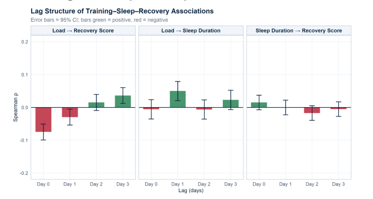
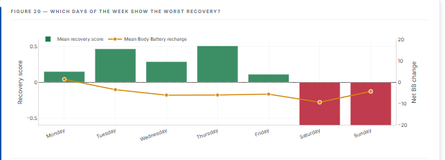
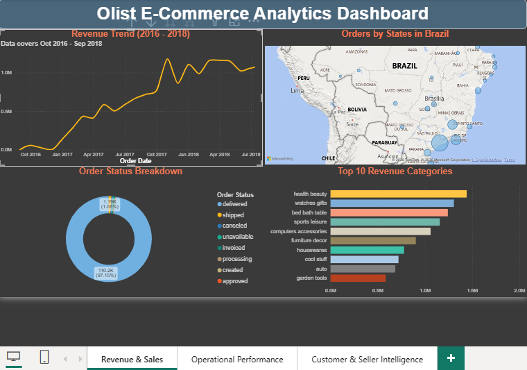
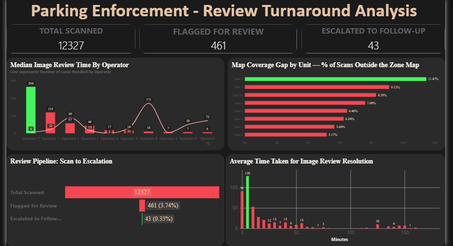

```{=html}
<style>
/* =========================================================
   RESET
   ========================================================= */

* { box-sizing: border-box; }
html { scroll-behavior: smooth; }

body {
  margin: 0;
  padding: 0;
  background: #F7F6F2;
}

#quarto-content,
.page-layout-full,
main.content {
  padding: 0 !important;
  margin: 0 !important;
  max-width: none !important;
}

.quarto-title-block {
  display: none !important;
}

  * { box-sizing: border-box; }
  html { scroll-behavior: smooth; }
  body { margin: 0; padding: 0; background: #F7F6F2; }

  :root {
    --navy:   #0D1B2A;
    --navy-2: #14263A;
    --teal:   #00A878;
    --teal-dark: #008A65;
    --gold:   #E8C547;
    --ink:    #1A1A2E;
    --mist:   #F7F6F2;
    --slate:  #4A5568;
    --muted:  #718096;
    --border: #E2E0DA;
    --card:   #FFFFFF;

    --display: 'Space Grotesk', sans-serif;
    --serif:   'Source Serif 4', Georgia, serif;
    --mono:    'JetBrains Mono', monospace;
  }

  a { text-decoration: none; }

  /* ── Nav ──────────────────────────────────────────────── */
  .site-nav {
    background: var(--card);
    border-bottom: 1px solid var(--border);
    position: sticky;
    top: 0;
    z-index: 50;
  }
  .site-nav-inner {
    max-width: 1000px;
    margin: 0 auto;
    padding: 15px 32px;
    display: flex;
    justify-content: space-between;
    align-items: center;
    gap: 20px;
  }
  .nav-brand {
    color: var(--ink);
    font-family: var(--mono);
    font-size: 11px;
    letter-spacing: 0.08em;
  }
  .nav-links { display: flex; flex-wrap: wrap; gap: 22px; }
  .nav-links a {
    color: var(--slate);
    font-family: var(--mono);
    font-size: 10px;
    letter-spacing: 0.05em;
  }
  .nav-links a:hover { color: var(--teal-dark); }

  /* ── Hero ─────────────────────────────────────────────── */
  .hero {
    background: var(--navy);
    padding: 90px 48px 80px;
    position: relative;
    overflow: hidden;
  }
  .hero::before {
    content: '';
    position: absolute;
    top: -60px; right: -60px;
    width: 420px; height: 420px;
    border-radius: 50%;
    background: radial-gradient(circle, rgba(0,168,120,0.14) 0%, transparent 70%);
    pointer-events: none;
  }
  .hero-inner { max-width: 860px; margin: 0 auto; position: relative; z-index: 1; }
  .hero-eyebrow {
    font-family: var(--mono); font-size: 12px; letter-spacing: 0.18em;
    color: var(--teal); text-transform: uppercase; margin-bottom: 20px;
  }
  .hero-name {
    font-family: var(--display); font-size: clamp(38px, 6vw, 68px);
    font-weight: 700; color: #F7F6F2; line-height: 1.05;
    margin: 0 0 18px; letter-spacing: -0.02em;
  }
  .hero-name span { color: var(--teal); }
  .hero-title {
    font-family: var(--serif); font-size: clamp(16px, 2.2vw, 20px);
    font-weight: 300; color: #A0AEC0; margin: 0 0 36px; line-height: 1.6; max-width: 580px;
  }
  .hero-title strong { color: #CBD5E0; font-weight: 400; }
  .hero-badges { display: flex; gap: 10px; flex-wrap: wrap; margin-bottom: 34px; }
  .badge {
    font-family: var(--mono); font-size: 11px; padding: 5px 12px;
    border-radius: 3px; letter-spacing: 0.06em;
  }
  .badge-outline { border: 1px solid rgba(255,255,255,0.18); color: #A0AEC0; background: transparent; }
  .badge-teal { background: rgba(0,168,120,0.15); color: var(--teal); border: 1px solid rgba(0,168,120,0.3); }
  .hero-ctas { display: flex; gap: 12px; flex-wrap: wrap; }
  .btn {
    font-family: var(--mono); font-size: 11px; letter-spacing: 0.06em;
    padding: 12px 20px; border-radius: 3px; display: inline-block;
  }
  .btn-primary { background: var(--teal); color: var(--navy); font-weight: 600; }
  .btn-primary:hover { background: #00C896; }
  .btn-outline { border: 1px solid rgba(255,255,255,0.25); color: #E2E8F0; }
  .btn-outline:hover { border-color: var(--teal); color: var(--teal); }
  
  .hero-role {
  font-family: var(--display);
  font-size: clamp(18px, 2.5vw, 24px);
  font-weight: 500;
  color: #CBD5E0;
  margin: 0 0 18px;
}

.hero-context {
  font-family: var(--mono);
  font-size: 11px;
  color: #718096;
  letter-spacing: 0.06em;
  margin: -18px 0 28px;
}

.hero-actions {
  display: flex;
  gap: 10px;
  flex-wrap: wrap;
  margin-bottom: 24px;
}

.hero-btn {
  font-family: var(--mono);
  font-size: 11px;
  letter-spacing: 0.05em;
  padding: 9px 16px;
  border-radius: 3px;
  text-decoration: none;
  transition: all 0.2s ease;
}

.hero-btn-primary {
  background: var(--teal);
  color: var(--navy);
  border: 1px solid var(--teal);
}

.hero-btn-secondary {
  background: transparent;
  color: #A0AEC0;
  border: 1px solid rgba(255,255,255,0.18);
}

.hero-btn-secondary:hover {
  color: var(--teal);
  border-color: rgba(0,168,120,0.5);
}

  /* ── Section wrapper ──────────────────────────────────── */
  .section { max-width: 860px; margin: 0 auto; padding: 76px 48px; }
  .section-label {
    font-family: var(--mono); font-size: 11px; letter-spacing: 0.18em;
    color: var(--teal); text-transform: uppercase; margin-bottom: 10px;
  }
  .section-title {
    font-family: var(--display); font-size: clamp(24px, 3.5vw, 34px);
    font-weight: 600; color: var(--ink); margin: 0 0 14px; letter-spacing: -0.02em;
  }
  .section-divider { width: 40px; height: 3px; background: var(--teal); border-radius: 2px; margin-bottom: 40px; }

  /* ── About ────────────────────────────────────────────── */
  .about-grid { display: grid; grid-template-columns: 1fr 1fr; gap: 48px; align-items: start; }
  .about-left { display: flex; flex-direction: column; gap: 28px; }
  .profile-photo-wrap { display: flex; align-items: center; gap: 24px; }
  .profile-photo {
    width: 130px; height: 130px; object-fit: cover; object-position: center top;
    border-radius: 6px; border: 3px solid var(--teal); box-shadow: 6px 6px 0px var(--teal); flex-shrink: 0;
  }
  .profile-meta { display: flex; flex-direction: column; gap: 6px; }
  .profile-name { font-family: var(--display); font-size: 20px; font-weight: 700; color: var(--ink); line-height: 1.2; }
  .profile-role { font-family: var(--mono); font-size: 11px; color: var(--teal); letter-spacing: 0.1em; text-transform: uppercase; }
  .profile-uni { font-family: var(--serif); font-size: 13px; color: var(--slate); font-style: italic; }
  .about-text { font-family: var(--serif); font-size: 17px; line-height: 1.8; color: var(--slate); }
  .about-text p { margin: 0 0 16px; }
  .about-stats { display: flex; flex-direction: column; gap: 26px; }
  .stat-label {
    font-family: var(--mono); font-size: 11px; letter-spacing: 0.12em; color: var(--slate);
    text-transform: uppercase; margin-bottom: 8px; display: flex; justify-content: space-between;
  }
  .stat-label span { color: var(--teal); font-weight: 500; }
  .stat-bar-bg { height: 4px; background: var(--border); border-radius: 2px; overflow: hidden; }
  .stat-bar-fill {
    height: 100%; background: linear-gradient(90deg, var(--teal), #00C896);
    border-radius: 2px; width: 0%; transition: width 1.2s cubic-bezier(0.4,0,0.2,1);
  }

  /* ── Impact strip ─────────────────────────────────────── */
  .impact-bg { background: var(--card); border-top: 1px solid var(--border); border-bottom: 1px solid var(--border); }
  .impact-grid { display: grid; grid-template-columns: repeat(4, 1fr); gap: 24px; }
  .impact-item { text-align: left; }
  .impact-number {
    font-family: var(--display); font-size: clamp(28px, 4vw, 38px); font-weight: 700;
    color: var(--teal-dark); line-height: 1; margin-bottom: 8px;
  }
  .impact-label { font-family: var(--mono); font-size: 11px; color: var(--slate); line-height: 1.5; letter-spacing: 0.02em; }

  /* ── Experience timeline ──────────────────────────────── */
  .timeline { position: relative; padding-left: 28px; }
  .timeline::before {
    content: ''; position: absolute; left: 5px; top: 6px; bottom: 6px;
    width: 2px; background: var(--border);
  }
  .tl-item { position: relative; padding-bottom: 44px; }
  .tl-item:last-child { padding-bottom: 0; }
  .tl-dot {
    position: absolute; left: -28px; top: 4px; width: 12px; height: 12px;
    border-radius: 50%; background: var(--teal); border: 3px solid var(--mist);
    box-shadow: 0 0 0 2px var(--teal);
  }
  .tl-dot.faded { background: var(--muted); box-shadow: 0 0 0 2px var(--border); }
  .tl-dates {
    font-family: var(--mono); font-size: 11px; color: var(--teal-dark);
    letter-spacing: 0.05em; margin-bottom: 6px;
  }
  .tl-role { font-family: var(--display); font-size: 18px; font-weight: 600; color: var(--ink); margin: 0 0 3px; }
  .tl-org { font-family: var(--mono); font-size: 12px; color: var(--slate); margin-bottom: 14px; }
  .tl-org span { color: var(--muted); }
  .tl-bullets { margin: 0; padding-left: 18px; }
  .tl-bullets li {
    font-family: var(--serif); font-size: 15px; line-height: 1.7; color: var(--slate); margin-bottom: 8px;
  }
  .tl-bullets li:last-child { margin-bottom: 0; }
  .tl-bullets li::marker { color: var(--teal); }

  /* ── Education ────────────────────────────────────────── */
  .edu-grid { display: flex; flex-direction: column; gap: 24px; }
  .edu-card {
    background: var(--card); border: 1px solid var(--border); border-left: 3px solid var(--teal);
    padding: 26px 28px; border-radius: 4px;
  }
  .edu-degree { font-family: var(--display); font-size: 17px; font-weight: 600; color: var(--ink); margin: 0 0 6px; }
  .edu-school { font-family: var(--mono); font-size: 12px; color: var(--teal-dark); margin-bottom: 10px; }
  .edu-meta { font-family: var(--serif); font-size: 14px; color: var(--slate); line-height: 1.6; }

  /* ── Projects ─────────────────────────────────────────── */
  .projects-bg { background: var(--navy); }
  .projects-bg .section-title { color: #F7F6F2; }
  .projects-bg .section-label { color: var(--teal); }
  .project-grid { display: grid; grid-template-columns: repeat(auto-fit, minmax(240px, 1fr)); gap: 20px; }
  .project-card {
    background: rgba(255,255,255,0.05); border: 1px solid rgba(255,255,255,0.10);
    border-radius: 6px; padding: 28px 26px 24px; transition: border-color 0.2s, transform 0.2s;
    text-decoration: none; display: block; position: relative; overflow: hidden;
  }
  .project-card::before {
    content: ''; position: absolute; top: 0; left: 0; right: 0; height: 3px;
    background: var(--teal); transform: scaleX(0); transform-origin: left; transition: transform 0.3s ease;
  }
  .project-card:hover { border-color: rgba(0,168,120,0.4); transform: translateY(-3px); }
  .project-card:hover::before { transform: scaleX(1); }
  .project-card.upcoming { border-style: dashed; opacity: 0.65; cursor: default; }
  .project-card.upcoming:hover { transform: none; border-color: rgba(255,255,255,0.10); }
  .project-card.upcoming::before { display: none; }
  .project-number { font-family: var(--mono); font-size: 11px; color: var(--teal); letter-spacing: 0.12em; margin-bottom: 14px; }
  .project-title { font-family: var(--display); font-size: 18px; font-weight: 600; color: #F7F6F2; margin: 0 0 10px; line-height: 1.3; }
  .project-desc { font-family: var(--serif); font-size: 14px; color: #A0AEC0; line-height: 1.6; margin: 0 0 20px; }
  .project-tags { display: flex; flex-wrap: wrap; gap: 6px; margin-bottom: 20px; }
  .tag { font-family: var(--mono); font-size: 10px; padding: 3px 8px; background: rgba(0,168,120,0.12); color: var(--teal); border-radius: 2px; letter-spacing: 0.06em; }
  .tag-gold { background: rgba(232,197,71,0.12); color: var(--gold); }
  .project-links { display: flex; gap: 20px; flex-wrap: wrap; }
  .project-link { font-family: var(--mono); font-size: 11px; color: var(--teal); letter-spacing: 0.08em; display: inline-flex; align-items: center; gap: 6px; }
  .project-link::after { content: '→'; }
  .upcoming-label { font-family: var(--mono); font-size: 10px; color: var(--gold); letter-spacing: 0.12em; text-transform: uppercase; }
  .project-thumb {
    width: 100%;
    aspect-ratio: 16 / 10;
    object-fit: cover;
    border-radius: 4px;
    margin-bottom: 18px;
    border: 1px solid rgba(255,255,255,0.10);
  }

  /* ── Skills ───────────────────────────────────────────── */
  .skills-grid { display: grid; grid-template-columns: 1fr 1fr; gap: 48px; }
  .skill-group-title {
    font-family: var(--display); font-size: 14px; font-weight: 600; color: var(--ink);
    letter-spacing: 0.04em; margin: 0 0 20px; padding-bottom: 10px; border-bottom: 1px solid var(--border);
  }
  .skill-list { display: flex; flex-direction: column; gap: 16px; }

  /* ── Contact ──────────────────────────────────────────── */
  .contact-bg { background: var(--navy); }
  .contact-bg .section-label { color: var(--teal); }
  .contact-title { font-family: var(--display); font-size: clamp(24px, 3.5vw, 34px); font-weight: 600; color: #F7F6F2; margin: 0 0 14px; letter-spacing: -0.02em; }
  .contact-text { font-family: var(--serif); font-size: 16px; color: #A0AEC0; line-height: 1.7; max-width: 560px; margin-bottom: 40px; }
  .contact-links { display: flex; flex-direction: column; gap: 14px; }
  .contact-links-full { max-width: 480px; }
  .contact-link-row {
    display: flex; align-items: center; gap: 12px; font-family: var(--mono); font-size: 13px;
    color: #E2E8F0; padding: 12px 0; border-bottom: 1px solid rgba(255,255,255,0.08);
  }
  .contact-link-row a { color: var(--teal); }
  .contact-link-row a:hover { color: #00C896; }
  .contact-icon { color: var(--teal); font-size: 14px; width: 18px; }

  /* ── Footer ───────────────────────────────────────────── */
  .footer { background: #091520; padding: 32px 48px; text-align: center; }
  .footer-text { font-family: var(--mono); font-size: 10px; color: #4A5568; letter-spacing: 0.07em; }
  .footer-text a { color: var(--teal); }

  /* ── Responsive ───────────────────────────────────────── */
  @media (max-width: 700px) {
    .hero { padding: 60px 24px 56px; }
    .section { padding: 56px 24px; }
    .about-grid, .skills-grid { grid-template-columns: 1fr; gap: 32px; }
    .impact-grid { grid-template-columns: 1fr 1fr; }
    .profile-photo { width: 100px; height: 100px; }
    .footer { padding: 26px 24px; }
    .nav-links { display: none; }
  }

</style>

<!-- ═══════════════════════════════════════════════════════
     NAV
════════════════════════════════════════════════════════ -->
<nav class="site-nav">
  <div class="site-nav-inner">
    <div class="nav-brand">AC / DATA</div>
    <div class="nav-links">
      <a href="#about">ABOUT</a>
      <a href="#experience">EXPERIENCE</a>
      <a href="#education">EDUCATION</a>
      <a href="#projects">PROJECTS</a>
      <a href="#skills">SKILLS</a>
      <a href="#contact">CONTACT</a>
    </div>
  </div>
</nav>

<!-- ═══════════════════════════════════════════════════════
     HERO
════════════════════════════════════════════════════════ -->
<section class="hero">
  <div class="hero-inner">

    <div class="hero-eyebrow">
      Analytics Engineering · Data Analytics
    </div>

    <h1 class="hero-name">
      Agu Charles<br>
      <span>Chibuike</span>
    </h1>

    <div class="hero-role">
      Analytics Engineer · Data Analyst
    </div>

    <p class="hero-title">
      I build reliable analytical workflows from raw operational data
      to analytical models, dashboards, and decision-ready insights.
    </p>

    <div class="hero-actions">
      <a href="cv.pdf" class="hero-btn hero-btn-primary">
        View CV
      </a>

      <a href="https://github.com/agucharles91-cpu"
         target="_blank"
         class="hero-btn hero-btn-secondary">
        GitHub
      </a>

      <a href="https://www.linkedin.com/in/agu-charles-3b8140128"
         target="_blank"
         class="hero-btn hero-btn-secondary">
        LinkedIn
      </a>

      <a href="#contact" class="hero-btn hero-btn-secondary">
        Contact
      </a>
    </div>

    <div class="hero-badges">
      <span class="badge badge-teal">SQL / PostgreSQL</span>
      <span class="badge badge-teal">Python / R</span>
      <span class="badge badge-teal">Power BI / DAX</span>
      <span class="badge badge-outline">dbt</span>
      <span class="badge badge-outline">Statistical Modelling</span>
      <span class="badge badge-outline">Data Engineering</span>
    </div>

  </div>
</section>

<!-- ═══════════════════════════════════════════════════════
     ABOUT
════════════════════════════════════════════════════════ -->
<div style="background: #F7F6F2;">
  <div class="section" id="about">
    <div class="section-label">About</div>
    <h2 class="section-title">Turning complex data into clear decisions</h2>
    <div class="section-divider"></div>
    <div class="about-grid">
      <div class="about-left">
        <div class="profile-photo-wrap">
          
          <div class="profile-meta">
            <div class="profile-name">Agu Charles<br>Chibuike</div>
            <div class="profile-role">Analytics Engineer</div>
            <div class="profile-uni">MSc Data Science<br>University of Nairobi</div>
          </div>
        </div>
        <div class="about-text">
          <p>
            I'm an analytics engineer with 5+ years of end-to-end experience
            designing data pipelines, warehousing solutions, and BI dashboards
            across IoT, EV infrastructure, technology, hospitality, and fitness
            sectors — spanning Dubai, Abu Dhabi, and Nairobi.
          </p>
          <p>
            My MSc capstone at the University of Nairobi investigates how
            training behaviour, sleep architecture, and recovery physiology
            interact across a cohort of 14 runners over four years — combining
            Garmin wearable data with mixed-effects modelling in R.
          </p>
          <p>
            Before analytics, I taught Chemistry and Physics — a background
            that still shapes how I work with data: define the measurement
            carefully, understand the underlying process, validate the result,
            and only then draw conclusions.
          </p>
        </div>
      </div>
      <div class="about-stats">
        <div class="stat-item">
          <div class="stat-label">SQL / PostgreSQL <span>Advanced</span></div>
          <div class="stat-bar-bg"><div class="stat-bar-fill" data-width="90"></div></div>
        </div>
        <div class="stat-item">
          <div class="stat-label">ETL / ELT &amp; dbt <span>Advanced</span></div>
          <div class="stat-bar-bg"><div class="stat-bar-fill" data-width="86"></div></div>
        </div>
        <div class="stat-item">
          <div class="stat-label">Power BI / DAX <span>Advanced</span></div>
          <div class="stat-bar-bg"><div class="stat-bar-fill" data-width="84"></div></div>
        </div>
        <div class="stat-item">
          <div class="stat-label">R / Shiny &amp; Statistical Modelling <span>Advanced</span></div>
          <div class="stat-bar-bg"><div class="stat-bar-fill" data-width="88"></div></div>
        </div>
        <div class="stat-item">
          <div class="stat-label">Python / Pandas <span>Proficient</span></div>
          <div class="stat-bar-bg"><div class="stat-bar-fill" data-width="76"></div></div>
        </div>
        <div class="stat-item">
          <div class="stat-label">Time Series &amp; Longitudinal Analysis <span>Advanced</span></div>
          <div class="stat-bar-bg"><div class="stat-bar-fill" data-width="85"></div></div>
        </div>
      </div>
    </div>
  </div>
</div>

<!-- ═══════════════════════════════════════════════════════
     IMPACT STRIP
════════════════════════════════════════════════════════ -->
<div class="impact-bg">
  <div class="section" style="padding-top: 48px; padding-bottom: 48px;">
    <div class="impact-grid">
      <div class="impact-item">
        <div class="impact-number">78→94%</div>
        <div class="impact-label">Data accuracy raised on ANPR &amp; IoT sensor pipelines</div>
      </div>
      <div class="impact-item">
        <div class="impact-number">60%+</div>
        <div class="impact-label">Reporting cycle time cut via SQL/Python automation</div>
      </div>
      <div class="impact-item">
        <div class="impact-number">12,760</div>
        <div class="impact-label">Wearable observations analysed in self-initiated study</div>
      </div>
      <div class="impact-item">
        <div class="impact-number">1,000+</div>
        <div class="impact-label">Members segmented for retention analysis at DROP 10</div>
      </div>
    </div>
  </div>
</div>

<!-- ═══════════════════════════════════════════════════════
     EXPERIENCE
════════════════════════════════════════════════════════ -->
<div style="background: #F7F6F2;">
  <div class="section" id="experience">
    <div class="section-label">Experience</div>
    <h2 class="section-title">Where I've built this</h2>
    <div class="section-divider"></div>

    <div class="timeline">

      <div class="tl-item">
        <div class="tl-dot"></div>
        <div class="tl-dates">SEP 2023 – OCT 2024</div>
        <h3 class="tl-role">Analytics Engineer</h3>
        <div class="tl-org">EVINET <span>· Abu Dhabi, UAE</span></div>
        <ul class="tl-bullets">
          <li>Developed and maintained ETL pipelines ingesting real-time telemetry from EV charging stations into a centralised Snowflake data warehouse, enabling sub-hourly operational reporting.</li>
          <li>Built Power BI dashboards monitoring uptime, session throughput, energy consumption, and fault frequency — the primary SLA reporting interface for commercial and operations teams.</li>
          <li>Implemented a multi-layer data validation framework on IoT sensor streams, improving data reliability for downstream analytics.</li>
          <li>Automated grid utilisation and performance reporting workflows, saving an estimated 15+ hours per reporting cycle.</li>
        </ul>
      </div>

      <div class="tl-item">
        <div class="tl-dot"></div>
        <div class="tl-dates">OCT 2022 – AUG 2023</div>
        <h3 class="tl-role">Data Analytics Consultant</h3>
        <div class="tl-org">DROP 10 Fitness &amp; Bar <span>· Dubai, UAE</span></div>
        <ul class="tl-bullets">
          <li>Designed and deployed customer analytics dashboards tracking acquisition, retention, churn risk, and lifetime value (LTV) — directly informing pricing and promotional strategy.</li>
          <li>Built automated reporting pipelines integrating POS, booking, and revenue data sources into unified dashboards, replacing fragmented manual reporting.</li>
          <li>Conducted cohort and segmentation analysis across 1,000+ members to identify high-value customer groups and early-stage churn signals.</li>
          <li>Tracked MRR, revenue per member, and utilisation rates, supporting measurable improvements in scheduling efficiency and member engagement.</li>
        </ul>
      </div>

      <div class="tl-item">
        <div class="tl-dot"></div>
        <div class="tl-dates">FEB 2022 – AUG 2023</div>
        <h3 class="tl-role">Technical Systems Analyst</h3>
        <div class="tl-org">Scansmart Technologies <span>· Dubai, UAE</span></div>
        <ul class="tl-bullets">
          <li>Supported ETL workflows transforming raw ANPR sensor logs into structured analytical datasets, underpinning system performance reporting across multiple client deployments.</li>
          <li>Improved data accuracy from ~78% to 94%+ — a 16-point gain sustained in production — by designing and implementing validation and data quality pipelines.</li>
          <li>Automated report generation using SQL and Python, reducing reporting cycle time by 60%+.</li>
          <li>Built Power BI dashboards tracking throughput, uptime, and recognition rates, and standardised data schemas across deployments to improve cross-site consistency.</li>
          <li>Led BI tool adoption across engineering and commercial teams, delivering training that accelerated time-to-insight for non-technical stakeholders.</li>
        </ul>
      </div>

      <div class="tl-item">
        <div class="tl-dot"></div>
        <div class="tl-dates">MAY 2020 – JAN 2022</div>
        <h3 class="tl-role">Commercial Analytics Lead</h3>
        <div class="tl-org">The Usual Café <span>· Dubai, UAE</span></div>
        <ul class="tl-bullets">
          <li>Designed Excel dashboards tracking revenue, customer traffic, product mix, and labour efficiency — converting raw POS data into weekly operational reporting for management.</li>
          <li>Developed inventory forecasting models that reduced waste and improved cost efficiency using historical sales trends and seasonal demand patterns.</li>
          <li>Delivered margin analysis, peak-hour optimisation insights, and staffing recommendations that informed scheduling decisions.</li>
        </ul>
      </div>

      <div class="tl-item">
        <div class="tl-dot faded"></div>
        <div class="tl-dates">2016</div>
        <h3 class="tl-role">Chemistry &amp; Physics Teacher</h3>
        <div class="tl-org">Lexington High School <span>· Lagos, Nigeria</span></div>
        <ul class="tl-bullets">
          <li>Taught Chemistry and Physics, building the habit of defining measurements carefully and validating results before drawing conclusions — a discipline that carried directly into my analytics work.</li>
        </ul>
      </div>

    </div>
  </div>
</div>

<!-- ═══════════════════════════════════════════════════════
     EDUCATION
════════════════════════════════════════════════════════ -->
<div class="impact-bg">
  <div class="section" id="education">
    <div class="section-label">Education</div>
    <h2 class="section-title">Academic background</h2>
    <div class="section-divider"></div>

    <div class="edu-grid">
      <div class="edu-card">
        <h3 class="edu-degree">MSc Data Science <span style="color:var(--muted); font-weight:400;">(In Progress)</span></h3>
        <div class="edu-school">University of Nairobi · Expected 2027 ·</div>
        <div class="edu-meta">Research interest: time series forecasting, financial analytics, applied machine learning.</div>
      </div>
      <div class="edu-card">
        <h3 class="edu-degree">BSc Chemistry (Honours)</h3>
        <div class="edu-school">University of Nigeria, Nsukka · 2015</div>
      </div>
    </div>
  </div>
</div>

<!-- ═══════════════════════════════════════════════════════
     PROJECTS
════════════════════════════════════════════════════════ -->
<div class="projects-bg">
  <div class="section" id="projects">
    <div class="section-label">Projects</div>
    <h2 class="section-title">Selected work</h2>
    <div class="section-divider"></div>
    <div class="project-grid">

      <div class="project-card">
        
        <div class="project-number">01 / MSc CAPSTONE</div>
        <div class="project-title">Training, Sleep &amp; Recovery Dynamics in Recreational Runners</div>
        <div class="project-desc">
          Longitudinal analysis of ~12,760 Garmin wearable observations from 14 runners
          over four years. Mixed-effects modelling identified sleep architecture (Deep+REM%)
          as the strongest predictor of next-morning recovery, with lag-structure analysis
          revealing a Day+3 supercompensation arc.
        </div>
        <div class="project-tags">
          <span class="tag">R</span><span class="tag">lme4</span><span class="tag">Longitudinal</span>
          <span class="tag">Plotly</span><span class="tag">Quarto</span>
        </div>
        <div class="project-links">
          <a class="project-link" href="nairobi_runners_report.html">View report</a>
          <a class="project-link" href="https://github.com/agucharles91-cpu/Nairobi-Runners" target="_blank" rel="noopener noreferrer">GitHub</a>
        </div>
      </div>

      <a class="project-card" href="https://agucharles.shinyapps.io/nairobi-runners/" target="_blank" rel="noopener noreferrer">
        
        <div class="project-number">01 / INTERACTIVE</div>
        <div class="project-title">Live Dashboard — Nairobi Runners</div>
        <div class="project-desc">
          47-figure interactive Shiny dashboard with global filters, individual athlete
          deep-dives, correlation matrices, lag analysis, and training monotony tracking.
        </div>
        <div class="project-tags">
          <span class="tag">Shiny</span><span class="tag">bslib</span><span class="tag">DT</span><span class="tag">shinyapps.io</span>
        </div>
        <span class="project-link">Open dashboard</span>
      </a>

      <a class="project-card" href="https://github.com/agucharles91-cpu/Olist-Ecommerce-Analytics" target="_blank" rel="noopener noreferrer">
        
        <div class="project-number">02 / ANALYTICS ENGINEERING</div>
        <div class="project-title">Olist E-Commerce Analytics</div>
        <div class="project-desc">
          End-to-end analytics engineering on 100k+ Brazilian orders. Star schema design,
          17 advanced SQL queries, cohort/Pareto analysis, and a 3-page Power BI dashboard.
          Surfaced R$15.42M total revenue, 92% on-time delivery, and a 97% one-time-purchase
          retention gap.
        </div>
        <div class="project-tags">
          <span class="tag">PostgreSQL</span><span class="tag">SQL</span><span class="tag">Power BI</span><span class="tag">Python</span>
        </div>
        <span class="project-link">View project</span>
      </a>

      <a class="project-card" href="https://github.com/agucharles91-cpu/Parking-Enforcement-Analytics" target="_blank" rel="noopener noreferrer">
        
        <div class="project-number">03 / ANALYTICS ENGINEERING</div>
        <div class="project-title">Parking Enforcement Analytics</div>
        <div class="project-desc">
          End-to-end pipeline on ~458K vehicle-scan enforcement events. Python ingestion,
          multi-layer anonymization, DuckDB + dbt (15 passing tests), and a Power BI
          dashboard. Found a fleet-wide map-coverage gap (5–11% of scans) and workload
          concentration in the review pipeline.
        </div>
        <div class="project-tags">
          <span class="tag">Python</span><span class="tag">DuckDB</span><span class="tag">dbt</span>
          <span class="tag">SQL</span><span class="tag tag-gold">Power BI</span>
        </div>
        <span class="project-link">View project</span>
      </a>

      <div class="project-card upcoming">
        <div class="project-number">05 / FINANCIAL ANALYTICS</div>
        <div class="project-title">Nigerian Financial Dataset</div>
        <div class="project-desc">
          Financial data analysis targeting the Nigerian market — sector performance,
          risk metrics, and business intelligence for investment and operations decisions.
        </div>
        <div class="project-tags">
          <span class="tag">SQL</span><span class="tag tag-gold">Power BI</span><span class="tag">Python</span>
        </div>
        <span class="upcoming-label">Coming soon</span>
      </div>

      <div class="project-card upcoming">
        <div class="project-number">06 / CHEMISTRY × DATA</div>
        <div class="project-title">Aqueous Solubility Prediction (AqSolDB)</div>
        <div class="project-desc">
          Predicting aqueous chemical solubility (LogS) using the AqSolDB dataset —
          combining a Chemistry background with a Python → PostgreSQL → dbt pipeline
          and RDKit molecular descriptors.
        </div>
        <div class="project-tags">
          <span class="tag">Python</span><span class="tag">RDKit</span><span class="tag">PostgreSQL</span>
          <span class="tag">dbt</span>
        </div>
        <span class="upcoming-label">In progress</span>
      </div>

    </div>
  </div>
</div>

<!-- ═══════════════════════════════════════════════════════
     SKILLS
════════════════════════════════════════════════════════ -->
<div style="background: #F7F6F2;">
  <div class="section" id="skills">
    <div class="section-label">Skills &amp; Tools</div>
    <h2 class="section-title">Technical toolkit</h2>
    <div class="section-divider"></div>
    <div class="skills-grid">
      <div>
        <div class="skill-group-title">Analytics &amp; Statistics</div>
        <div class="skill-list">
          <div class="stat-item">
            <div class="stat-label">Mixed-effects modelling (lme4) <span>Advanced</span></div>
            <div class="stat-bar-bg"><div class="stat-bar-fill" data-width="84"></div></div>
          </div>
          <div class="stat-item">
            <div class="stat-label">Time series &amp; longitudinal analysis <span>Advanced</span></div>
            <div class="stat-bar-bg"><div class="stat-bar-fill" data-width="85"></div></div>
          </div>
          <div class="stat-item">
            <div class="stat-label">Cohort &amp; customer segmentation <span>Advanced</span></div>
            <div class="stat-bar-bg"><div class="stat-bar-fill" data-width="82"></div></div>
          </div>
          <div class="stat-item">
            <div class="stat-label">Window functions &amp; CTEs <span>Advanced</span></div>
            <div class="stat-bar-bg"><div class="stat-bar-fill" data-width="86"></div></div>
          </div>
        </div>
      </div>
      <div>
        <div class="skill-group-title">Engineering &amp; Visualisation</div>
        <div class="skill-list">
          <div class="stat-item">
            <div class="stat-label">ETL/ELT pipelines (Snowflake, dbt) <span>Advanced</span></div>
            <div class="stat-bar-bg"><div class="stat-bar-fill" data-width="86"></div></div>
          </div>
          <div class="stat-item">
            <div class="stat-label">Star schema &amp; data modelling <span>Proficient</span></div>
            <div class="stat-bar-bg"><div class="stat-bar-fill" data-width="80"></div></div>
          </div>
          <div class="stat-item">
            <div class="stat-label">Plotly &amp; ggplot2 <span>Advanced</span></div>
            <div class="stat-bar-bg"><div class="stat-bar-fill" data-width="90"></div></div>
          </div>
          <div class="stat-item">
            <div class="stat-label">DAX &amp; Power BI data models <span>Advanced</span></div>
            <div class="stat-bar-bg"><div class="stat-bar-fill" data-width="84"></div></div>
          </div>
        </div>
      </div>
    </div>
  </div>
</div>

<!-- ═══════════════════════════════════════════════════════
     CONTACT
════════════════════════════════════════════════════════ -->
<div class="contact-bg">
  <div class="section" id="contact">
    <div class="section-label">Contact</div>
    <h2 class="contact-title">Let's talk about your data.</h2>
    <p class="contact-text">
      Open to analytics engineering and data science roles. Reach out directly
    </p>
    <div class="contact-links contact-links-full">
      <div class="contact-link-row"><span class="contact-icon">✉</span> <a href="mailto:agucharles91@yahoo.com">agucharles91@yahoo.com</a></div>
      <div class="contact-link-row"><span class="contact-icon">☎</span> <a href="tel:+254743010351">+254 743 010 351</a></div>
      <div class="contact-link-row"><span class="contact-icon">◈</span> <a href="https://www.linkedin.com/in/agu-charles-3b8140128" target="_blank" rel="noopener noreferrer">linkedin.com/in/agu-charles-3b8140128</a></div>
      <div class="contact-link-row"><span class="contact-icon">◇</span> <a href="https://github.com/agucharles91-cpu" target="_blank" rel="noopener noreferrer">github.com/agucharles91-cpu</a></div>
    </div>
  </div>
</div>

<!-- ═══════════════════════════════════════════════════════
     FOOTER
════════════════════════════════════════════════════════ -->
<footer class="footer">
  <div class="footer-text">
    Agu Charles Chibuike &nbsp;·&nbsp;
    <a href="https://github.com/agucharles91-cpu" target="_blank">GitHub</a>
    &nbsp;·&nbsp;
    <a href="https://agucharles.shinyapps.io/nairobi-runners/" target="_blank">Live Dashboard</a>
  </div>
</footer>

<script>
  const bars = document.querySelectorAll('.stat-bar-fill');
  const observer = new IntersectionObserver((entries) => {
    entries.forEach(entry => {
      if (entry.isIntersecting) {
        const bar = entry.target;
        const width = bar.getAttribute('data-width');
        setTimeout(() => { bar.style.width = width + '%'; }, 120);
        observer.unobserve(bar);
      }
    });
  }, { threshold: 0.3 });
  bars.forEach(bar => observer.observe(bar));
</script>
```
