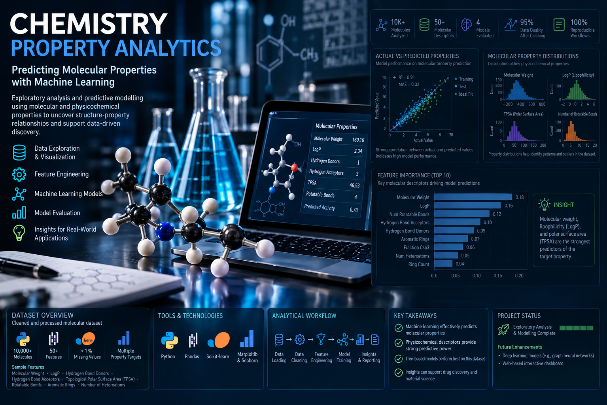

```{=html}
<style>

* { box-sizing: border-box; }

html {
  scroll-behavior: smooth;
}

body {
  margin: 0;
  padding: 0;
  background: #F7F6F2;
}

#quarto-content,
.page-layout-full,
main.content {
  padding: 0 !important;
  margin: 0 !important;
  max-width: none !important;
}

.quarto-title-block {
  display: none !important;
}

:root {
  --navy: #0D1B2A;
  --navy-2: #14263A;
  --teal: #00A878;
  --teal-dark: #008A65;
  --gold: #E8C547;
  --ink: #1A1A2E;
  --mist: #F7F6F2;
  --slate: #4A5568;
  --muted: #718096;
  --border: #E2E0DA;
  --card: #FFFFFF;

  --display: 'Space Grotesk', sans-serif;
  --serif: 'Source Serif 4', Georgia, serif;
  --mono: 'JetBrains Mono', monospace;
}

a {
  text-decoration: none;
}

/* =========================================================
   NAVIGATION
   ========================================================= */

.site-nav {
  background: rgba(255,255,255,0.96);
  border-bottom: 1px solid var(--border);
  position: sticky;
  top: 0;
  z-index: 100;
  backdrop-filter: blur(8px);
}

.site-nav-inner {
  max-width: 1120px;
  margin: 0 auto;
  padding: 15px 32px;
  display: flex;
  justify-content: space-between;
  align-items: center;
  gap: 24px;
}

.nav-brand {
  color: var(--ink);
  font-family: var(--mono);
  font-size: 11px;
  letter-spacing: 0.08em;
  white-space: nowrap;
}

.nav-links {
  display: flex;
  flex-wrap: wrap;
  gap: 22px;
}

.nav-links a {
  color: var(--slate);
  font-family: var(--mono);
  font-size: 10px;
  letter-spacing: 0.05em;
}

.nav-links a:hover {
  color: var(--teal-dark);
}

/* =========================================================
   HERO
   ========================================================= */

.hero {
  background: var(--navy);
  padding: 105px 32px 95px;
  position: relative;
  overflow: hidden;
}

.hero::before {
  content: '';
  position: absolute;
  width: 600px;
  height: 600px;
  right: -200px;
  top: -250px;
  border-radius: 50%;
  background: radial-gradient(
    circle,
    rgba(0,168,120,0.16) 0%,
    transparent 68%
  );
}

.hero::after {
  content: '';
  position: absolute;
  width: 360px;
  height: 360px;
  left: -220px;
  bottom: -220px;
  border-radius: 50%;
  border: 1px solid rgba(255,255,255,0.05);
}

.hero-inner {
  max-width: 960px;
  margin: 0 auto;
  position: relative;
  z-index: 2;
}

.hero-eyebrow {
  font-family: var(--mono);
  font-size: 11px;
  letter-spacing: 0.18em;
  color: var(--teal);
  text-transform: uppercase;
  margin-bottom: 22px;
}

.hero-name {
  font-family: var(--display);
  font-size: clamp(42px, 7vw, 76px);
  font-weight: 700;
  color: #F7F6F2;
  line-height: 0.98;
  margin: 0 0 24px;
  letter-spacing: -0.035em;
}

.hero-name span {
  color: var(--teal);
}

.hero-role {
  font-family: var(--display);
  font-size: clamp(20px, 3vw, 28px);
  font-weight: 500;
  color: #CBD5E0;
  margin-bottom: 18px;
}

.hero-description {
  font-family: var(--serif);
  font-size: clamp(17px, 2.3vw, 21px);
  font-weight: 300;
  color: #A0AEC0;
  line-height: 1.65;
  max-width: 720px;
  margin: 0 0 34px;
}

.hero-description strong {
  color: #E2E8F0;
  font-weight: 400;
}

.hero-context {
  font-family: var(--mono);
  font-size: 10px;
  color: #718096;
  letter-spacing: 0.07em;
  line-height: 1.8;
  margin-bottom: 34px;
  max-width: 700px;
}

.hero-actions {
  display: flex;
  gap: 10px;
  flex-wrap: wrap;
}

.hero-btn {
  font-family: var(--mono);
  font-size: 10px;
  letter-spacing: 0.06em;
  padding: 12px 18px;
  border-radius: 3px;
  transition: all 0.2s ease;
}

.hero-btn-primary {
  background: var(--teal);
  color: var(--navy);
  border: 1px solid var(--teal);
  font-weight: 600;
}

.hero-btn-primary:hover {
  background: #00C896;
}

.hero-btn-secondary {
  color: #CBD5E0;
  border: 1px solid rgba(255,255,255,0.18);
}

.hero-btn-secondary:hover {
  color: var(--teal);
  border-color: rgba(0,168,120,0.5);
}

/* =========================================================
   GENERAL SECTIONS
   ========================================================= */

.section {
  max-width: 960px;
  margin: 0 auto;
  padding: 82px 32px;
}

.section-label {
  font-family: var(--mono);
  font-size: 10px;
  letter-spacing: 0.18em;
  color: var(--teal);
  text-transform: uppercase;
  margin-bottom: 10px;
}

.section-title {
  font-family: var(--display);
  font-size: clamp(27px, 4vw, 38px);
  font-weight: 600;
  color: var(--ink);
  margin: 0 0 14px;
  letter-spacing: -0.025em;
}

.section-intro {
  font-family: var(--serif);
  font-size: 17px;
  line-height: 1.75;
  color: var(--slate);
  max-width: 690px;
  margin: 0 0 34px;
}

.section-divider {
  width: 42px;
  height: 3px;
  background: var(--teal);
  border-radius: 2px;
  margin-bottom: 42px;
}

/* =========================================================
   POSITIONING
   ========================================================= */

  .about-profile {
  display: block;
}

.profile-photo {
  width: 130px;
  height: 130px;
  object-fit: cover;
  object-position: center top;

  float: left;
  margin: 0 28px 12px 0;

  border-radius: 6px;
  border: 3px solid var(--teal);
  box-shadow: 6px 6px 0px var(--teal);
}
  .profile-photo {
    width: 130px; height: 130px; object-fit: cover; object-position: center top;
    border-radius: 6px; border: 3px solid var(--teal); box-shadow: 6px 6px 0px var(--teal); flex-shrink: 0;
  }


.positioning-bg {
  background: var(--card);
  border-bottom: 1px solid var(--border);
}

.positioning-grid {
  display: grid;
  grid-template-columns: 1.15fr 0.85fr;
  gap: 60px;
  align-items: start;
}

.positioning-text {
  font-family: var(--serif);
  font-size: 17px;
  line-height: 1.85;
  color: var(--slate);
}

.positioning-text p {
  margin: 0 0 18px;
}

.positioning-text strong {
  color: var(--ink);
  font-weight: 600;
}

.positioning-list {
  border-left: 2px solid var(--teal);
  padding-left: 24px;
}

.positioning-item {
  margin-bottom: 24px;
}

.positioning-item:last-child {
  margin-bottom: 0;
}

.positioning-item-title {
  font-family: var(--display);
  font-size: 15px;
  font-weight: 600;
  color: var(--ink);
  margin-bottom: 5px;
}

.positioning-item-text {
  font-family: var(--serif);
  font-size: 14px;
  color: var(--slate);
  line-height: 1.6;
}

/* =========================================================
   SELECTED PROJECTS
   ========================================================= */

.projects-bg {
  background: var(--navy);
}

.projects-bg .section-title {
  color: #F7F6F2;
}

.projects-bg .section-intro {
  color: #A0AEC0;
}

.featured-grid {
  display: grid;
  grid-template-columns: repeat(3, 1fr);
  gap: 22px;
}

.project-card {
  background: rgba(255,255,255,0.045);
  border: 1px solid rgba(255,255,255,0.11);
  border-radius: 7px;
  overflow: hidden;
  display: flex;
  flex-direction: column;
  min-height: 420px;
  transition:
    transform 0.2s ease,
    border-color 0.2s ease,
    background 0.2s ease;
}

.project-card:hover {
  transform: translateY(-4px);
  border-color: rgba(0,168,120,0.5);
  background: rgba(255,255,255,0.065);
}

.project-card-top {
  padding: 25px 25px 0;
}

.project-number {
  font-family: var(--mono);
  font-size: 9px;
  letter-spacing: 0.14em;
  color: var(--teal);
  text-transform: uppercase;
  margin-bottom: 14px;
}

.project-title {
  font-family: var(--display);
  font-size: 21px;
  font-weight: 600;
  color: #F7F6F2;
  line-height: 1.25;
  margin: 0 0 14px;
}

.project-question {
  font-family: var(--serif);
  font-size: 15px;
  color: #CBD5E0;
  line-height: 1.65;
  margin: 0;
}

.project-bottom {
  margin-top: auto;
  padding: 22px 25px 25px;
}

.project-type {
  font-family: var(--mono);
  font-size: 9px;
  letter-spacing: 0.1em;
  color: #718096;
  text-transform: uppercase;
  margin-bottom: 13px;
}

.project-tags {
  display: flex;
  flex-wrap: wrap;
  gap: 5px;
  margin-bottom: 21px;
}

.tag {
  font-family: var(--mono);
  font-size: 9px;
  padding: 4px 7px;
  background: rgba(0,168,120,0.11);
  color: var(--teal);
  border-radius: 2px;
}

.project-action {
  font-family: var(--mono);
  font-size: 10px;
  color: var(--teal);
  letter-spacing: 0.07em;
}

.project-action::after {
  content: ' →';
}

.project-thumb-large {
  width: 100%;
  height: 180px;
  object-fit: cover;
  display: block;
}


/* =========================================================
   ADDITIONAL WORK
   ========================================================= */

.additional-label {
  font-family: var(--mono);
  font-size: 10px;
  letter-spacing: 0.16em;
  color: rgba(255,255,255,0.38);
  text-transform: uppercase;
  margin: 58px 0 18px;
}

.additional-grid {
  display: grid;
  grid-template-columns: 1fr;
  gap: 14px;
}

.additional-card {
  display: grid;
  grid-template-columns: 140px 1fr auto;
  gap: 24px;
  align-items: center;
  padding: 20px 22px;
  border: 1px solid rgba(255,255,255,0.09);
  border-radius: 6px;
  background: rgba(255,255,255,0.025);
  transition: border-color 0.2s ease;
}

.additional-card:hover {
  border-color: rgba(0,168,120,0.35);
}

.additional-number {
  font-family: var(--mono);
  font-size: 9px;
  color: var(--teal);
  letter-spacing: 0.12em;
}

.additional-title {
  font-family: var(--display);
  font-size: 17px;
  font-weight: 600;
  color: #F7F6F2;
  margin-bottom: 5px;
}

.additional-description {
  font-family: var(--serif);
  font-size: 13px;
  color: #A0AEC0;
  line-height: 1.55;
}

.additional-action {
  font-family: var(--mono);
  font-size: 9px;
  color: var(--teal);
  white-space: nowrap;
}

.additional-card .project-thumb-large {
  width: 140px;
  height: 85px;
  object-fit: cover;
  border-radius: 4px;
  display: block;
}

/* =========================================================
   EXPERIENCE
   ========================================================= */

.experience-grid {
  display: grid;
  grid-template-columns: 1fr;
  gap: 0;
}

.experience-intro {
  font-family: var(--serif);
  font-size: 17px;
  color: var(--slate);
  line-height: 1.8;
  max-width: 700px;
  margin-bottom: 42px;
}

.experience-highlights {
  display: grid;
  grid-template-columns: repeat(3, 1fr);
  gap: 18px;
}

.experience-card {
  background: var(--card);
  border: 1px solid var(--border);
  border-top: 3px solid var(--teal);
  padding: 23px;
  border-radius: 4px;
}

.experience-date {
  font-family: var(--mono);
  font-size: 9px;
  color: var(--teal-dark);
  letter-spacing: 0.08em;
  margin-bottom: 8px;
}

.experience-role {
  font-family: var(--display);
  font-size: 16px;
  font-weight: 600;
  color: var(--ink);
  margin-bottom: 4px;
}

.experience-org {
  font-family: var(--mono);
  font-size: 10px;
  color: var(--slate);
  margin-bottom: 13px;
}

.experience-description {
  font-family: var(--serif);
  font-size: 13px;
  line-height: 1.65;
  color: var(--slate);
}

/* =========================================================
   EDUCATION
   ========================================================= */

.education-bg {
  background: var(--card);
  border-top: 1px solid var(--border);
  border-bottom: 1px solid var(--border);
}

.education-grid {
  display: grid;
  grid-template-columns: 1fr 1fr;
  gap: 18px;
}

.education-card {
  border: 1px solid var(--border);
  border-left: 3px solid var(--teal);
  padding: 25px;
  border-radius: 4px;
}

.education-degree {
  font-family: var(--display);
  font-size: 17px;
  font-weight: 600;
  color: var(--ink);
  margin-bottom: 7px;
}

.education-school {
  font-family: var(--mono);
  font-size: 10px;
  color: var(--teal-dark);
  letter-spacing: 0.03em;
  margin-bottom: 10px;
}

.education-description {
  font-family: var(--serif);
  font-size: 13px;
  line-height: 1.65;
  color: var(--slate);
}

/* =========================================================
   SKILLS
   ========================================================= */

.skills-grid {
  display: grid;
  grid-template-columns: repeat(3, 1fr);
  gap: 18px;
}

.skill-card {
  padding: 24px;
  border: 1px solid var(--border);
  border-radius: 4px;
  background: var(--card);
}

.skill-title {
  font-family: var(--display);
  font-size: 15px;
  font-weight: 600;
  color: var(--ink);
  margin-bottom: 13px;
}

.skill-list {
  font-family: var(--mono);
  font-size: 10px;
  line-height: 2;
  color: var(--slate);
}

  /* ── Contact ──────────────────────────────────────────── */
  .contact-bg { background: var(--navy); }
  .contact-bg .section-label { color: var(--teal); }
  .contact-title { font-family: var(--display); font-size: clamp(24px, 3.5vw, 34px); font-weight: 600; color: #F7F6F2; margin: 0 0 14px; letter-spacing: -0.02em; }
  .contact-text { font-family: var(--serif); font-size: 16px; color: #A0AEC0; line-height: 1.7; max-width: 560px; margin-bottom: 40px; }
  .contact-links { display: flex; gap: 20px; flex-wrap: wrap; }
  .contact-card {
    display: flex; align-items: center; justify-content: center;
    width: 64px; height: 64px; border-radius: 50%;
    background: rgba(255,255,255,0.05); border: 1px solid rgba(255,255,255,0.12);
    color: var(--teal); text-decoration: none; transition: border-color 0.2s, background 0.2s, transform 0.2s;
  }
  .contact-card:hover { border-color: rgba(0,168,120,0.5); background: rgba(0,168,120,0.12); transform: translateY(-3px); }
  .contact-card svg { width: 26px; height: 26px; }


/* =========================================================
   FOOTER
   ========================================================= */

.footer {
  background: #091520;
  padding: 28px 32px;
  text-align: center;
}

.footer-text {
  font-family: var(--mono);
  font-size: 9px;
  color: #4A5568;
  letter-spacing: 0.06em;
}

.footer-text a {
  color: var(--teal);
}

/* =========================================================
   MOBILE
   ========================================================= */

@media (max-width: 850px) {

  .featured-grid {
    grid-template-columns: 1fr;
  }

  .positioning-grid {
    grid-template-columns: 1fr;
    gap: 38px;
  }

  .experience-highlights {
    grid-template-columns: 1fr;
  }

  .skills-grid {
    grid-template-columns: 1fr;
  }

}

@media (max-width: 650px) {

  .hero {
    padding: 72px 24px 65px;
  }

  .section {
    padding: 62px 24px;
  }

  .site-nav-inner {
    padding: 13px 20px;
  }

  .nav-links {
    display: none;
  }

  .education-grid {
    grid-template-columns: 1fr;
  }

  .additional-card {
    grid-template-columns: 1fr;
    gap: 9px;
  }

  .additional-action {
    margin-top: 6px;
  }

}

</style>


<!-- =====================================================
     NAVIGATION
     ===================================================== -->

<nav class="site-nav">

  <div class="site-nav-inner">

    <div class="nav-brand">
      AC / DATA
    </div>

    <div class="nav-links">
      <a href="#about">ABOUT</a>
      <a href="#projects">PROJECTS</a>
      <a href="#experience">EXPERIENCE</a>
      <a href="#education">EDUCATION</a>
      <a href="#skills">SKILLS</a>
      <a href="#contact">CONTACT</a>
    </div>

  </div>

</nav>


<!-- =====================================================
     HERO
     ===================================================== -->

<section class="hero">

  <div class="hero-inner">

    <div class="hero-eyebrow">
      Analytics Engineering · Data Analytics · Data Science
    </div>

    <h1 class="hero-name">
      Agu Charles<br>
      <span>Chibuike</span>
    </h1>

    <div class="hero-role">
      Analytics Engineer &amp; Data Analyst
    </div>

    <p class="hero-description">
      I build <strong>reliable analytical systems</strong> that turn
      raw operational and scientific data into structured models,
      rigorous analysis, and decision-ready outputs.
    </p>

    <div class="hero-context">
      5+ YEARS PROFESSIONAL EXPERIENCE &nbsp;·&nbsp;
      MSc DATA SCIENCE &nbsp;·&nbsp;
      BSc CHEMISTRY &nbsp;·&nbsp;
      NAIROBI, KENYA
    </div>

    <div class="hero-actions">

      <a href="cv.pdf"
         class="hero-btn hero-btn-primary">
        VIEW CV
      </a>

      <a href="https://github.com/agucharles91-cpu"
         target="_blank"
         rel="noopener noreferrer"
         class="hero-btn hero-btn-secondary">
        GITHUB
      </a>

      <a href="https://www.linkedin.com/in/agu-charles-3b8140128"
         target="_blank"
         rel="noopener noreferrer"
         class="hero-btn hero-btn-secondary">
        LINKEDIN
      </a>

      <a href="#projects"
         class="hero-btn hero-btn-secondary">
        VIEW PROJECTS
      </a>

    </div>

  </div>

</section>


<!-- =====================================================
     POSITIONING / ABOUT
     ===================================================== -->

<div class="positioning-bg">

  <div class="section" id="about">

    <div class="section-label">
      Positioning
    </div>

    <h2 class="section-title">
      Engineering the layer between data and decisions
    </h2>

    <div class="section-divider"></div>

<div class="positioning-grid">

  <div class="positioning-text">

    <div class="about-profile">

      

      <div class="profile-meta">

        <p>
          My work sits at the intersection of
          <strong>analytics engineering, data analysis,
          business intelligence, and applied data science.</strong>
        </p>

        <p>
          I am most interested in the part of analytics that is often
          invisible in the final dashboard: understanding the source data,
          designing reliable transformations, modelling the data correctly,
          validating the result, and choosing an analytical method that
          actually fits the question.
        </p>

        <p>
          My background in Chemistry also influences how I approach
          analytical problems. I tend to start with the measurement and
          underlying process, rather than beginning with a preferred
          visualisation or model.
        </p>

      </div>

    </div>

  </div>


  <div class="positioning-list">

    <div class="positioning-item">

      <div class="positioning-item-title">
        Data systems
      </div>

      <div class="positioning-item-text">
        ETL/ELT pipelines, SQL, PostgreSQL, Snowflake,
        DuckDB, dbt and analytical data modelling.
      </div>

        </div>


        <div class="positioning-item">

          <div class="positioning-item-title">
            Analytical work
          </div>

          <div class="positioning-item-text">
            Exploratory analysis, cohort analysis, longitudinal
            analysis, statistical modelling and applied machine learning.
          </div>

        </div>


        <div class="positioning-item">

          <div class="positioning-item-title">
            Decision support
          </div>

          <div class="positioning-item-text">
            Power BI, Tableau and reproducible analytical reporting
            designed to communicate evidence rather than simply display data.
          </div>

        </div>


        <div class="positioning-item">

          <div class="positioning-item-title">
            Scientific perspective
          </div>

          <div class="positioning-item-text">
            A chemistry background combined with ongoing postgraduate
            training in data science.
          </div>

        </div>

      </div>

    </div>

  </div>

</div>


<!-- =====================================================
     PROJECTS
     ===================================================== -->

<div class="projects-bg">

  <div class="section" id="projects">

    <div class="section-label">
      Selected Work
    </div>

    <h2 class="section-title">
      Projects that demonstrate how I work
    </h2>

    <p class="section-intro">
      These projects are deliberately different. Together they demonstrate
      analytical engineering, scientific modelling, longitudinal analysis,
      business intelligence, and the ability to work from raw data through
      to an interpretable result.
    </p>

    <div class="featured-grid">


      <!-- PARKING -->

      <a class="project-card"
         href="projects/parking-enforcement-analytics.html">
            

        <div class="project-card-top">

          <div class="project-number">
            01 / ANALYTICS ENGINEERING
          </div>

          <h3 class="project-title">
            Parking Enforcement Analytics
          </h3>

          <p class="project-question">
            How can operational enforcement data be transformed into a
            reliable analytical system for monitoring performance,
            workload, and operational coverage?
          </p>

        </div>

        <div class="project-bottom">

          <div class="project-type">
            Operational analytics · Analytics engineering
          </div>

          <div class="project-tags">
            <span class="tag">Python</span>
            <span class="tag">Parquet</span>
            <span class="tag">DuckDB</span>
            <span class="tag">dbt</span>
            <span class="tag">SQL</span>
            <span class="tag">Power BI</span>
          </div>

          <div class="project-action">
            VIEW CASE STUDY
          </div>

        </div>

      </a>


      <!-- NAIROBI RUNNERS -->

      <a class="project-card"
         href="projects/nairobi-runners/nairobi-runners.html">
         

        <div class="project-card-top">

          <div class="project-number">
            02 / SPORTS SCIENCE
          </div>

          <h3 class="project-title">
            Nairobi Runners Analytics
          </h3>

          <p class="project-question">
            How do training behaviour, sleep, and recovery interact
            longitudinally across recreational runners?
          </p>

        </div>

        <div class="project-bottom">

          <div class="project-type">
            Longitudinal analysis · Applied statistics
          </div>

          <div class="project-tags">
            <span class="tag">R</span>
            <span class="tag">Longitudinal</span>
            <span class="tag">Mixed Effects</span>
            <span class="tag">Quarto</span>
            <span class="tag">Garmin</span>
          </div>

          <div class="project-action">
            VIEW CASE STUDY
          </div>

        </div>

      </a>


      <!-- AQSOLDB -->

      <a class="project-card"
         href="projects/chemistry-properties-analytics/chemistry-properties-analytics.html">
         
        <div class="project-card-top">

          <div class="project-number">
            03 / SCIENTIFIC DATA SCIENCE
          </div>

          <h3 class="project-title">
            Chemical Property Analytics
          </h3>

          <p class="project-question">
            Can molecular structure and physicochemical properties be used
            to predict aqueous solubility, and what can the model reveal
            about chemical behaviour?
          </p>

        </div>

        <div class="project-bottom">

          <div class="project-type">
            Chemistry · Machine learning · Scientific modelling
          </div>

          <div class="project-tags">
            <span class="tag">Python</span>
            <span class="tag">RDKit</span>
            <span class="tag">PostgreSQL</span>
            <span class="tag">Machine Learning</span>
            <span class="tag">Validation</span>
          </div>

          <div class="project-action">
            VIEW CASE STUDY
          </div>

        </div>

      </a>

    </div>


    <!-- ADDITIONAL WORK -->

    <div class="additional-label">
      Additional Work
    </div>

    <div class="additional-grid">

      <a class="additional-card"
         href="projects/olist-ecommerce/olist-ecommerce.html">
         

        <div class="additional-number">
          04 / BUSINESS ANALYTICS
        </div>

        <div>

          <div class="additional-title">
            Olist E-Commerce Analytics
          </div>

          <div class="additional-description">
            PostgreSQL, dimensional modelling, SQL analytics and Power BI
            applied to Brazilian e-commerce data.
          </div>

        </div>

        <div class="additional-action">
          CASE STUDY →
        </div>

      </a>


      <a class="additional-card"
         href="https://agucharles.shinyapps.io/nairobi-runners/"
         target="_blank"
         rel="noopener noreferrer">
         

        <div class="additional-number">
          05 / INTERACTIVE ANALYTICS
        </div>

        <div>

          <div class="additional-title">
            Nairobi Runners Interactive
          </div>

          <div class="additional-description">
            An interactive Shiny application for exploring athlete-level
            training, recovery, sleep, and longitudinal patterns.
          </div>

        </div>

        <div class="additional-action">
          OPEN APPLICATION →
        </div>

      </a>

    </div>

  </div>

</div>


<!-- =====================================================
     EXPERIENCE
     ===================================================== -->

<div>

  <div class="section" id="experience">

    <div class="section-label">
      Professional Experience
    </div>

    <h2 class="section-title">
      The projects build on real-world experience
    </h2>

    <div class="section-divider"></div>

    <p class="experience-intro">
      My portfolio projects are not intended to substitute for professional
      experience. They extend it by demonstrating how I apply analytical
      methods independently and document the reasoning behind them.
    </p>


    <div class="experience-highlights">


      <div class="experience-card">

        <div class="experience-date">
          2023 – 2024
        </div>

        <div class="experience-role">
          Analytics Engineer
        </div>

        <div class="experience-org">
          EVINET · Abu Dhabi
        </div>

        <div class="experience-description">
          Built and maintained analytical pipelines around EV charging
          telemetry, data validation, operational reporting and Power BI.
        </div>

      </div>


      <div class="experience-card">

        <div class="experience-date">
          2022 – 2023
        </div>

        <div class="experience-role">
          Technical Systems Analyst
        </div>

        <div class="experience-org">
          Scansmart Technologies · Dubai
        </div>

        <div class="experience-description">
          Worked with ANPR and IoT data, ETL workflows, data-quality
          pipelines, SQL/Python automation and operational BI.
        </div>

      </div>


      <div class="experience-card">

        <div class="experience-date">
          2022 – 2023
        </div>

        <div class="experience-role">
          Data Analytics Consultant
        </div>

        <div class="experience-org">
          DROP 10 Fitness &amp; Bar · Dubai
        </div>

        <div class="experience-description">
          Built customer, retention, cohort and revenue analytics,
          connecting operational data to business decisions.
        </div>

      </div>


    </div>

  </div>

</div>


<!-- =====================================================
     EDUCATION
     ===================================================== -->

<div class="education-bg">

  <div class="section" id="education">

    <div class="section-label">
      Education
    </div>

    <h2 class="section-title">
      Scientific foundation, data-science training
    </h2>

    <div class="section-divider"></div>

    <div class="education-grid">


      <div class="education-card">

        <div class="education-degree">
          MSc Data Science
        </div>

        <div class="education-school">
          University of Nairobi · In Progress
        </div>

        <div class="education-description">
          Postgraduate study in data science, supported by independent
          work in statistical modelling, machine learning, longitudinal
          analysis and applied analytics.
        </div>

      </div>


      <div class="education-card">

        <div class="education-degree">
          BSc Chemistry (Honours)
        </div>

        <div class="education-school">
          University of Nigeria, Nsukka · 2015
        </div>

        <div class="education-description">
          Scientific training that continues to inform how I approach
          measurement, experimental reasoning, uncertainty and evidence.
        </div>

      </div>


    </div>

  </div>

</div>


<!-- =====================================================
     SKILLS
     ===================================================== -->

<div>

  <div class="section" id="skills">

    <div class="section-label">
      Technical Focus
    </div>

    <h2 class="section-title">
      The tools behind the work
    </h2>

    <div class="section-divider"></div>

    <div class="skills-grid">


      <div class="skill-card">

        <div class="skill-title">
          Data Engineering &amp; SQL
        </div>

        <div class="skill-list">
          PostgreSQL<br>
          SQL<br>
          Snowflake<br>
          DuckDB<br>
          dbt<br>
          ETL / ELT<br>
          Data modelling
        </div>

      </div>


      <div class="skill-card">

        <div class="skill-title">
          Analytics &amp; Data Science
        </div>

        <div class="skill-list">
          Python<br>
          R<br>
          Pandas<br>
          Statistical modelling<br>
          Longitudinal analysis<br>
          Machine learning<br>
          Feature engineering
        </div>

      </div>


      <div class="skill-card">

        <div class="skill-title">
          BI &amp; Communication
        </div>

        <div class="skill-list">
          Power BI<br>
          DAX<br>
          Tableau<br>
          Quarto<br>
          Shiny<br>
          Data visualisation<br>
          Analytical reporting
        </div>

      </div>


    </div>

  </div>

</div>


<!-- ═══════════════════════════════════════════════════════
     CONTACT
════════════════════════════════════════════════════════ -->
<div class="contact-bg">
  <div class="section" id="contact">
    <div class="section-label">Contact</div>
    <h2 class="contact-title">Looking for analytical problems worth solving.</h2>
    <p class="contact-text">
      I am open to opportunities across analytics engineering, data analytics, business intelligence, and applied data science.
    </p>
    <div class="contact-links">
      <a class="contact-card" href="mailto:agucharles91@yahoo.com" aria-label="Email" title="Email">
        <svg viewBox="0 0 24 24" fill="none" stroke="currentColor" stroke-width="2" stroke-linecap="round" stroke-linejoin="round"><path d="M22 6L12 13 2 6"/><path d="M2 6h20v12H2z"/></svg>
      </a>

      <a class="contact-card" href="tel:+254743010351" aria-label="Phone" title="Phone">
        <svg viewBox="0 0 24 24" fill="none" stroke="currentColor" stroke-width="2" stroke-linecap="round" stroke-linejoin="round"><path d="M22 16.92v3a2 2 0 0 1-2.18 2 19.79 19.79 0 0 1-8.63-3.07 19.5 19.5 0 0 1-6-6 19.79 19.79 0 0 1-3.07-8.67A2 2 0 0 1 4.11 2h3a2 2 0 0 1 2 1.72c.127.96.361 1.903.7 2.81a2 2 0 0 1-.45 2.11L8.09 9.91a16 16 0 0 0 6 6l1.27-1.27a2 2 0 0 1 2.11-.45c.907.339 1.85.573 2.81.7A2 2 0 0 1 22 16.92z"/></svg>
      </a>

      <a class="contact-card" href="https://www.linkedin.com/in/agu-charles-3b8140128" target="_blank" rel="noopener noreferrer" aria-label="LinkedIn" title="LinkedIn">
        <svg viewBox="0 0 24 24" fill="currentColor"><path d="M20.45 20.45h-3.55v-5.57c0-1.33-.02-3.03-1.85-3.03-1.86 0-2.14 1.45-2.14 2.94v5.66H9.36V9h3.41v1.56h.05c.47-.9 1.63-1.85 3.36-1.85 3.6 0 4.27 2.37 4.27 5.45v6.29zM5.34 7.43a2.06 2.06 0 1 1 0-4.12 2.06 2.06 0 0 1 0 4.12zM7.12 20.45H3.56V9h3.56v11.45z"/></svg>
      </a>

      <a class="contact-card" href="https://github.com/agucharles91-cpu" target="_blank" rel="noopener noreferrer" aria-label="GitHub" title="GitHub">
        <svg viewBox="0 0 24 24" fill="currentColor"><path d="M12 2C6.48 2 2 6.58 2 12.25c0 4.53 2.87 8.37 6.84 9.73.5.1.68-.22.68-.49 0-.24-.01-.87-.01-1.7-2.78.62-3.37-1.37-3.37-1.37-.46-1.2-1.11-1.52-1.11-1.52-.91-.64.07-.62.07-.62 1 .07 1.53 1.05 1.53 1.05.89 1.56 2.34 1.11 2.91.85.09-.66.35-1.11.63-1.37-2.22-.26-4.56-1.14-4.56-5.06 0-1.12.39-2.03 1.03-2.75-.1-.26-.45-1.31.1-2.73 0 0 .84-.28 2.75 1.05a9.3 9.3 0 0 1 2.5-.35c.85 0 1.7.12 2.5.35 1.91-1.33 2.75-1.05 2.75-1.05.55 1.42.2 2.47.1 2.73.64.72 1.03 1.63 1.03 2.75 0 3.93-2.34 4.79-4.57 5.05.36.32.68.94.68 1.9 0 1.37-.01 2.47-.01 2.81 0 .27.18.6.69.49A10.26 10.26 0 0 0 22 12.25C22 6.58 17.52 2 12 2z"/></svg>
      </a>
    </div>
  </div>
</div>


<!-- =====================================================
     FOOTER
     ===================================================== -->

<footer class="footer">

  <div class="footer-text">

    Agu Charles Chibuike
    &nbsp;·&nbsp;
    Analytics Engineering / Data Analytics / Data Science
    &nbsp;·&nbsp;
    Nairobi, Kenya

  </div>

</footer>
```
