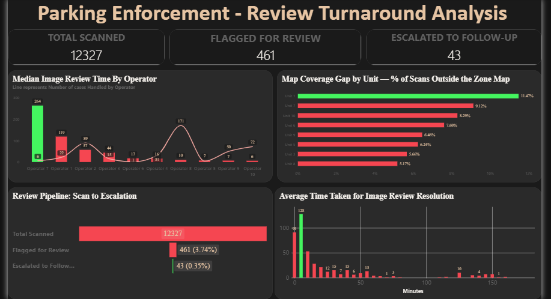

```{=html}
<style>
/* =========================================================
   AGU CHARLES CHIBUIKE — CASE STUDY
   Operational Analytics / Parking Enforcement Analytics
   ========================================================= */


/* =========================================================
   DESIGN TOKENS
   ========================================================= */

:root {
  --navy: #0D1B2A;
  --navy-2: #14263A;
  --teal: #00A878;
  --teal-dark: #008A65;
  --gold: #E8C547;

  --ink: #1A1A2E;
  --slate: #4A5568;
  --muted: #718096;

  --mist: #F7F6F2;
  --white: #FFFFFF;
  --border: #E2E0DA;

  --display: "Space Grotesk", sans-serif;
  --serif: "Source Serif 4", Georgia, serif;
  --mono: "JetBrains Mono", monospace;

  --content-width: 1180px;
  --text-width: 760px;
}


/* =========================================================
   GLOBAL RESET
   ========================================================= */

*,
*::before,
*::after {
  box-sizing: border-box;
}

html {
  scroll-behavior: smooth;
}

body {
  margin: 0;
  padding: 0;
  background: var(--white);
  color: var(--ink);
  font-family: var(--serif);
  font-size: 17px;
  line-height: 1.7;
}

body,
.quarto-container,
#quarto-content,
main {
  max-width: none !important;
}

main {
  margin: 0 !important;
  padding: 0 !important;
}

p {
  margin: 0 0 20px;
}

a {
  color: inherit;
}

strong {
  font-weight: 600;
}

::selection {
  background: rgba(0,168,120,0.18);
}


/* =========================================================
   HIDE QUARTO DEFAULT CHROME
   ========================================================= */

#quarto-header,
.navbar,
.sidebar,
.sidebar-navigation,
.quarto-title-block,
.quarto-title-banner,
#TOC {
  display: none !important;
}


/* =========================================================
   NAVIGATION
   ========================================================= */

.case-nav {
  background: var(--navy);
  border-bottom: 1px solid rgba(255,255,255,0.09);
}

.case-nav-inner {
  width: min(var(--content-width), calc(100% - 48px));
  margin: 0 auto;

  min-height: 76px;

  display: flex;
  align-items: center;
  justify-content: space-between;
}

.case-nav-back,
.case-nav-brand {
  font-family: var(--mono);
  font-size: 10px;
  letter-spacing: 0.08em;
  text-transform: uppercase;
}

.case-nav-back {
  color: rgba(255,255,255,0.65);
  text-decoration: none;

  transition: color 0.2s ease;
}

.case-nav-back:hover {
  color: var(--teal);
}

.case-nav-brand {
  color: var(--white);
  font-weight: 500;
}


/* =========================================================
   HERO
   ========================================================= */

.case-hero {
  background: var(--navy);
  color: var(--white);

  padding: 105px 0 100px;

  position: relative;
  overflow: hidden;
}

.case-hero::after {
  content: "";

  position: absolute;
  width: 340px;
  height: 340px;

  right: -120px;
  bottom: -180px;

  border: 1px solid rgba(0,168,120,0.16);
  border-radius: 50%;

  pointer-events: none;
}

.case-hero-inner {
  width: min(var(--content-width), calc(100% - 48px));
  margin: 0 auto;

  max-width: 900px;
  margin-left: max(24px, calc((100% - var(--content-width)) / 2));
}

.case-kicker {
  font-family: var(--mono);
  font-size: 10px;
  letter-spacing: 0.18em;
  color: var(--teal);
  text-transform: uppercase;

  margin-bottom: 25px;
}

.case-title {
  font-family: var(--display);
  font-size: clamp(52px, 7vw, 88px);
  font-weight: 600;
  line-height: 0.98;
  letter-spacing: -0.045em;

  margin: 0 0 32px;

  color: var(--white);
}

.case-subtitle {
  max-width: 730px;

  font-family: var(--serif);
  font-size: 22px;
  line-height: 1.55;

  color: #CBD5E0;

  margin-bottom: 34px;
}

.case-meta {
  display: flex;
  flex-wrap: wrap;
  gap: 8px;

  margin-bottom: 34px;
}

.case-meta span {
  font-family: var(--mono);
  font-size: 9px;
  letter-spacing: 0.07em;
  text-transform: uppercase;

  color: var(--teal);

  border: 1px solid rgba(0,168,120,0.3);
  background: rgba(0,168,120,0.07);

  padding: 7px 10px;
  border-radius: 2px;
}


/* =========================================================
   BUTTONS / LINKS
   ========================================================= */

.case-links {
  display: flex;
  flex-wrap: wrap;
  gap: 12px;
}

.case-btn {
  display: inline-flex;
  align-items: center;
  justify-content: center;

  min-height: 44px;
  padding: 11px 17px;

  font-family: var(--mono);
  font-size: 10px;
  letter-spacing: 0.06em;
  text-transform: uppercase;

  text-decoration: none;

  border-radius: 3px;

  transition:
    background 0.2s ease,
    color 0.2s ease,
    border-color 0.2s ease,
    transform 0.2s ease;
}

.case-btn:hover {
  transform: translateY(-2px);
}

.case-btn-primary {
  background: var(--teal);
  color: var(--navy);

  border: 1px solid var(--teal);
}

.case-btn-primary:hover {
  background: #08B985;
  color: var(--navy);
}

.case-btn-secondary {
  color: var(--ink);
  background: transparent;

  border: 1px solid var(--border);
}

.case-btn-secondary:hover {
  border-color: var(--teal);
  color: var(--teal-dark);
}


/* =========================================================
   STATS STRIP
   ========================================================= */

.stats-strip {
  display: grid;
  grid-template-columns: repeat(4, 1fr);

  border-bottom: 1px solid var(--border);
  background: var(--mist);
}

.stat {
  min-height: 145px;

  padding: 30px 28px;

  display: flex;
  flex-direction: column;
  justify-content: center;

  border-right: 1px solid var(--border);
}

.stat:last-child {
  border-right: none;
}

.stat-value {
  font-family: var(--display);
  font-size: 34px;
  font-weight: 600;
  line-height: 1;

  color: var(--navy);

  margin-bottom: 10px;
}

.stat-label {
  font-family: var(--mono);
  font-size: 9px;
  line-height: 1.5;
  letter-spacing: 0.08em;

  color: var(--muted);
  text-transform: uppercase;
}


/* =========================================================
   GENERAL SECTION
   ========================================================= */

.case-section {
  width: min(var(--content-width), calc(100% - 48px));
  margin: 0 auto;

  padding-top: 105px;
  padding-bottom: 105px;
}

.case-section-num {
  font-family: var(--mono);
  font-size: 10px;
  letter-spacing: 0.16em;

  color: var(--teal);
  text-transform: uppercase;

  margin-bottom: 22px;
}

.case-section-title {
  max-width: 850px;

  font-family: var(--display);
  font-size: clamp(34px, 4vw, 52px);
  font-weight: 600;
  line-height: 1.1;
  letter-spacing: -0.025em;

  color: var(--ink);

  margin: 0 0 28px;
}

.section-intro {
  max-width: var(--text-width);

  font-family: var(--serif);
  font-size: 18px;
  color: var(--slate);

  margin-bottom: 38px;
}


/* =========================================================
   INTRO / QUESTION
   ========================================================= */

.case-intro {
  width: min(var(--content-width), calc(100% - 48px));
  margin: 0 auto;

  padding: 105px 0;
}

.case-two-column {
  display: grid;
  grid-template-columns: minmax(280px, 0.85fr) minmax(320px, 1.15fr);
  gap: 90px;
  align-items: start;
}

.case-two-column h2 {
  font-family: var(--display);
  font-size: clamp(34px, 4vw, 50px);
  font-weight: 600;
  line-height: 1.1;
  letter-spacing: -0.03em;

  color: var(--ink);

  margin: 0;
}

.case-two-column p {
  max-width: 700px;
  color: var(--slate);
}

.case-two-column .lead {
  font-size: 20px;
  line-height: 1.6;
  color: var(--ink);
}


/* =========================================================
   DARK SECTIONS
   ========================================================= */

.dark-section {
  background: var(--navy);
  color: var(--white);
}

.section-title-light {
  max-width: 850px;

  font-family: var(--display);
  font-size: clamp(34px, 4vw, 52px);
  font-weight: 600;
  line-height: 1.1;
  letter-spacing: -0.03em;

  color: var(--white);

  margin: 0 0 45px;
}


/* =========================================================
   DATA CARDS
   ========================================================= */

.data-grid {
  display: grid;
  grid-template-columns: repeat(3, 1fr);
  gap: 16px;

  margin-top: 42px;
}

.data-card {
  padding: 30px;

  min-height: 235px;

  border: 1px solid rgba(255,255,255,0.1);
  border-radius: 5px;

  background: rgba(255,255,255,0.035);
}

.data-number {
  font-family: var(--display);
  font-size: 38px;
  font-weight: 600;
  line-height: 1;

  color: var(--teal);

  margin-bottom: 18px;
}

.data-heading {
  font-family: var(--display);
  font-size: 18px;
  font-weight: 600;

  color: var(--white);

  margin-bottom: 10px;
}

.data-card p {
  font-size: 15px;
  line-height: 1.6;

  color: #A0AEC0;

  margin: 0;
}

.source-note {
  margin-top: 28px;

  font-family: var(--mono);
  font-size: 9px;
  line-height: 1.7;

  color: #718096;

  text-transform: uppercase;
  letter-spacing: 0.04em;
}

.source-note strong {
  color: #A0AEC0;
}


/* =========================================================
   PIPELINE
   ========================================================= */

.pipeline {
  display: flex;
  align-items: stretch;

  margin-top: 48px;

  overflow-x: auto;

  padding-bottom: 8px;
}

.pipeline-step {
  flex: 1;
  min-width: 145px;

  padding: 22px 18px;

  border: 1px solid var(--border);
  background: var(--mist);

  display: flex;
  align-items: center;
  gap: 14px;
}

.pipeline-number {
  width: 30px;
  height: 30px;

  flex: 0 0 30px;

  display: flex;
  align-items: center;
  justify-content: center;

  border-radius: 50%;

  background: var(--navy);
  color: var(--teal);

  font-family: var(--mono);
  font-size: 9px;
}

.pipeline-step strong {
  display: block;

  font-family: var(--display);
  font-size: 13px;
  font-weight: 600;

  color: var(--ink);

  margin-bottom: 3px;
}

.pipeline-step span {
  display: block;

  font-family: var(--mono);
  font-size: 8px;
  letter-spacing: 0.04em;

  color: var(--muted);
}

.pipeline-arrow {
  flex: 0 0 auto;

  display: flex;
  align-items: center;
  justify-content: center;

  width: 30px;

  font-family: var(--mono);
  font-size: 14px;

  color: var(--teal);
}


/* =========================================================
   SPLIT SECTIONS
   ========================================================= */

.split-section {
  display: grid;
  grid-template-columns: minmax(0, 1.35fr) minmax(280px, 0.65fr);

  gap: 80px;

  width: min(var(--content-width), calc(100% - 48px));
  margin: 0 auto;

  padding: 105px 0;
}

.split-content h2 {
  max-width: 760px;

  font-family: var(--display);
  font-size: clamp(36px, 4vw, 54px);
  font-weight: 600;
  line-height: 1.08;
  letter-spacing: -0.03em;

  color: var(--ink);

  margin: 0 0 30px;
}

.split-content > p {
  max-width: 720px;
  color: var(--slate);
}

.split-aside {
  display: flex;
  align-items: flex-start;
  justify-content: flex-end;
}


/* =========================================================
   METHOD CALLOUT
   ========================================================= */

.method-callout {
  margin-top: 34px;
  padding: 22px 24px;

  border-left: 3px solid var(--teal);

  background: var(--mist);

  display: flex;
  flex-direction: column;
  gap: 7px;
}

.method-callout strong {
  font-family: var(--mono);
  font-size: 9px;
  letter-spacing: 0.1em;
  text-transform: uppercase;

  color: var(--teal-dark);
}

.method-callout span {
  font-family: var(--serif);
  font-size: 16px;
  line-height: 1.55;

  color: var(--slate);
}


/* =========================================================
   METHOD CARD
   ========================================================= */

.method-card {
  width: 100%;
  max-width: 340px;

  padding: 32px;

  background: var(--navy);

  border-radius: 5px;

  box-shadow: 8px 8px 0 var(--teal);
}

.method-label {
  font-family: var(--mono);
  font-size: 9px;
  letter-spacing: 0.12em;

  color: var(--teal);

  text-transform: uppercase;

  margin-bottom: 18px;
}

.method-big {
  font-family: var(--display);
  font-size: 56px;
  font-weight: 600;
  line-height: 1;

  color: var(--white);

  margin-bottom: 18px;
}

.method-card p {
  font-size: 15px;
  line-height: 1.6;

  color: #A0AEC0;

  margin: 0;
}


/* =========================================================
   RESULTS
   ========================================================= */

.results-section {
  background: var(--mist);

  border-top: 1px solid var(--border);
  border-bottom: 1px solid var(--border);
}

.result-grid {
  display: grid;
  grid-template-columns: repeat(3, 1fr);
  gap: 16px;

  margin-top: 45px;
}

.result-card {
  padding: 30px;

  min-height: 210px;

  background: var(--white);

  border: 1px solid var(--border);
  border-radius: 5px;
}

.result-primary {
  border-top: 3px solid var(--teal);
}

.result-label {
  font-family: var(--mono);
  font-size: 9px;
  letter-spacing: 0.1em;

  color: var(--muted);

  text-transform: uppercase;

  margin-bottom: 28px;
}

.result-number {
  font-family: var(--display);
  font-size: 50px;
  font-weight: 600;
  line-height: 1;

  color: var(--navy);

  margin-bottom: 9px;
}

.result-caption {
  font-family: var(--mono);
  font-size: 9px;
  letter-spacing: 0.08em;

  color: var(--teal-dark);

  text-transform: uppercase;
}


/* =========================================================
   CHART PLACEHOLDERS
   ========================================================= */

.chart-placeholder {
  min-height: 330px;

  margin-top: 42px;

  display: flex;
  flex-direction: column;
  align-items: center;
  justify-content: center;

  text-align: center;

  border: 1px dashed #C8C6BF;
  background: rgba(255,255,255,0.5);

  padding: 40px;
}

.chart-placeholder-label {
  font-family: var(--mono);
  font-size: 9px;
  letter-spacing: 0.14em;

  color: var(--teal-dark);

  text-transform: uppercase;

  margin-bottom: 12px;
}

.chart-placeholder p {
  max-width: 500px;

  font-family: var(--serif);
  font-size: 15px;

  color: var(--muted);

  margin: 0;
}

.chart-dark {
  border-color: rgba(255,255,255,0.15);
  background: rgba(255,255,255,0.035);
}

.chart-dark .chart-placeholder-label {
  color: var(--teal);
}

.chart-dark p {
  color: #718096;
}


/* =========================================================
   FINDINGS
   ========================================================= */

.finding-layout {
  display: grid;
  grid-template-columns: 0.8fr 1.2fr;
  gap: 60px;
  align-items: center;
}

.finding-stat {
  font-family: var(--display);
  font-size: clamp(64px, 8vw, 100px);
  font-weight: 600;
  line-height: 0.95;

  color: var(--teal);

  margin-bottom: 15px;
}

.finding-heading {
  font-family: var(--display);
  font-size: 25px;
  font-weight: 600;

  color: var(--white);

  margin-bottom: 18px;
}

.finding-main p {
  max-width: 520px;

  color: #A0AEC0;
}

.calibration-callout {
  width: 100%;
  box-sizing: border-box;
  margin-top: 42px;
}

/* =========================================================
   APPLICABILITY DOMAIN
   ========================================================= */

.ad-stat-grid {
  display: grid;
  grid-template-columns: repeat(2, 1fr);

  gap: 12px;

  margin-top: 35px;
}

.ad-stat-grid > div {
  padding: 20px;

  background: var(--mist);
  border: 1px solid var(--border);

  display: flex;
  flex-direction: column;
}

.ad-stat-grid strong {
  font-family: var(--display);
  font-size: 30px;
  line-height: 1;

  color: var(--teal-dark);

  margin-bottom: 8px;
}

.ad-stat-grid span {
  font-family: var(--mono);
  font-size: 9px;
  letter-spacing: 0.08em;

  color: var(--ink);

  text-transform: uppercase;

  margin-bottom: 7px;
}

.ad-stat-grid small {
  font-family: var(--serif);
  font-size: 12px;
  line-height: 1.45;

  color: var(--muted);
}


/* =========================================================
   EXPLAINABILITY
   ========================================================= */

.explain-grid {
  display: grid;
  grid-template-columns: 0.85fr 1.15fr;

  gap: 75px;

  align-items: center;
}

.lead-light {
  font-family: var(--serif);
  font-size: 22px;
  line-height: 1.55;

  color: var(--white);
}

.light-text {
  color: #A0AEC0;
}

.explain-grid strong {
  color: var(--white);
}


/* =========================================================
   WHAT I BUILT
   ========================================================= */

.build-grid {
  display: grid;
  grid-template-columns: repeat(2, 1fr);

  gap: 16px;

  margin-top: 45px;
}

.build-card {
  padding: 30px;

  border: 1px solid var(--border);
  border-radius: 5px;

  background: var(--white);
}

.build-number {
  font-family: var(--mono);
  font-size: 10px;
  letter-spacing: 0.1em;

  color: var(--teal);

  margin-bottom: 22px;
}

.build-card h3 {
  font-family: var(--display);
  font-size: 21px;
  font-weight: 600;

  color: var(--ink);

  margin: 0 0 10px;
}

.build-card p {
  font-size: 15px;
  line-height: 1.6;

  color: var(--slate);

  margin: 0;
}


/* =========================================================
   LIMITATIONS
   ========================================================= */

.limitations {
  margin: 0;
  padding: 0;

  list-style: none;

  max-width: 760px;
}

.limitations li {
  position: relative;

  padding: 0 0 20px 28px;
  margin-bottom: 20px;

  border-bottom: 1px solid var(--border);

  color: var(--slate);
}

.limitations li::before {
  content: "—";

  position: absolute;
  left: 0;
  top: 0;

  color: var(--teal);

  font-family: var(--mono);
}

.limitation-note {
  width: 100%;
  max-width: 340px;

  padding: 30px;

  background: var(--mist);

  border-left: 3px solid var(--gold);
}

.limitation-note p {
  font-family: var(--serif);
  font-size: 19px;
  line-height: 1.5;

  color: var(--ink);

  margin: 0;
}


/* =========================================================
   EVIDENCE
   ========================================================= */

.evidence-section {
  background: var(--mist);

  border-top: 1px solid var(--border);
}

.evidence-section h2 {
  font-family: var(--display);
  font-size: clamp(36px, 4vw, 54px);
  font-weight: 600;
  line-height: 1.1;
  letter-spacing: -0.03em;

  color: var(--ink);

  margin: 0 0 25px;
}

.evidence-section p {
  max-width: 680px;

  color: var(--slate);

  margin-bottom: 30px;
}


/* =========================================================
   FOOTER
   ========================================================= */

.case-footer {
  min-height: 100px;

  padding: 30px max(24px, calc((100% - var(--content-width)) / 2));

  display: flex;
  align-items: center;
  justify-content: space-between;

  background: var(--navy);

  color: rgba(255,255,255,0.6);

  font-family: var(--mono);
  font-size: 9px;
  letter-spacing: 0.08em;
  text-transform: uppercase;
}

.case-footer a {
  color: rgba(255,255,255,0.6);
  text-decoration: none;

  transition: color 0.2s ease;
}

.case-footer a:hover {
  color: var(--teal);
}


/* =========================================================
   RESPONSIVE — TABLET
   ========================================================= */

@media (max-width: 900px) {

  .case-hero {
    padding: 85px 0 80px;
  }

  .case-title {
    font-size: clamp(48px, 9vw, 72px);
  }

  .case-two-column,
  .finding-layout,
  .explain-grid {
    grid-template-columns: 1fr;
    gap: 45px;
  }

  .split-section {
    grid-template-columns: 1fr;
    gap: 45px;
  }

  .split-aside {
    justify-content: flex-start;
  }

  .method-card,
  .limitation-note {
    max-width: none;
  }

  .data-grid {
    grid-template-columns: 1fr;
  }

  .result-grid {
    grid-template-columns: 1fr;
  }

  .build-grid {
    grid-template-columns: 1fr;
  }

  .stats-strip {
    grid-template-columns: repeat(2, 1fr);
  }

  .stat:nth-child(2) {
    border-right: none;
  }

  .stat:nth-child(-n+2) {
    border-bottom: 1px solid var(--border);
  }

  .stat:nth-child(3) {
    border-right: 1px solid var(--border);
  }
}


/* =========================================================
   RESPONSIVE — MOBILE
   ========================================================= */

@media (max-width: 650px) {

  body {
    font-size: 16px;
  }

  .case-nav-inner,
  .case-hero-inner,
  .case-section,
  .case-intro {
    width: calc(100% - 36px);
  }

  .case-nav-inner {
    min-height: 64px;
  }

  .case-nav-brand {
    display: none;
  }

  .case-hero {
    padding: 65px 0 65px;
  }

  .case-kicker {
    font-size: 9px;
    margin-bottom: 20px;
  }

  .case-title {
    font-size: clamp(44px, 13vw, 60px);
    margin-bottom: 25px;
  }

  .case-subtitle {
    font-size: 18px;
  }

  .case-meta {
    gap: 6px;
  }

  .case-meta span {
    font-size: 8px;
    padding: 6px 8px;
  }

  .case-section,
  .case-intro,
  .split-section {
    padding-top: 72px;
    padding-bottom: 72px;
  }

  .case-two-column h2,
  .split-content h2,
  .case-section-title,
  .section-title-light {
    font-size: 34px;
  }

  .case-two-column {
    gap: 30px;
  }

  .case-two-column .lead {
    font-size: 18px;
  }

  .stats-strip {
    grid-template-columns: 1fr 1fr;
  }

  .stat {
    min-height: 125px;
    padding: 22px 18px;
  }

  .stat-value {
    font-size: 29px;
  }

  .stat-label {
    font-size: 8px;
  }

  .pipeline {
    display: grid;
    grid-template-columns: 1fr;
    gap: 8px;
  }

  .pipeline-step {
    min-width: 0;
  }

  .pipeline-arrow {
    width: auto;
    height: 18px;
    transform: rotate(90deg);
  }

  .finding-stat {
    font-size: 72px;
  }

  .ad-stat-grid {
    grid-template-columns: 1fr;
  }

  .chart-placeholder {
    min-height: 250px;
    padding: 25px;
  }

  .case-links {
    flex-direction: column;
    align-items: stretch;
  }

  .case-btn {
    width: 100%;
  }

  .case-footer {
    min-height: 120px;

    padding: 28px 18px;

    align-items: flex-start;

    flex-direction: column;
    gap: 18px;
  }
}


/* =========================================================
   ACCESSIBILITY
   ========================================================= */

@media (prefers-reduced-motion: reduce) {

  html {
    scroll-behavior: auto;
  }

  *,
  *::before,
  *::after {
    transition: none !important;
  }
}
</style>
```


```{=html}
<nav class="case-nav">
  <div class="case-nav-inner">
    <a class="case-nav-back" href="../index.html#projects">← All Projects</a>
    <div class="case-nav-brand">AC / DATA</div>
  </div>
</nav>


<section class="case-hero">
  <div class="case-hero-inner">

    <div class="case-kicker">OPERATIONAL ANALYTICS</div>

    <h1 class="case-title">
      Parking Enforcement<br>
      Analytics
    </h1>

    <p class="case-subtitle">
      From raw enforcement events to operational intelligence. A
      reproducible analytics pipeline built to understand enforcement
      activity, review workflows, operator workload, and coverage gaps
      from real-world parking enforcement data.
    </p>

    <div class="case-meta">
      <span>Python</span>
      <span>DuckDB</span>
      <span>dbt</span>
      <span>Power BI</span>
    </div>

    <div class="case-links">
      <a
        class="case-btn case-btn-primary"
        href="https://github.com/agucharles91-cpu/Parking-Enforcement-Analytics"
        target="_blank"
        rel="noopener noreferrer">
        View on GitHub
      </a>
      <a
        class="case-btn case-btn-secondary"
        href="#dashboard">
        View Dashboard
      </a>
    </div>

  </div>
</section>


<section class="stats-strip">

  <div class="stat">
    <div class="stat-value">~458K</div>
    <div class="stat-label">Enforcement events</div>
  </div>

  <div class="stat">
    <div class="stat-value">3.7%</div>
    <div class="stat-label">Detailed scans entered review</div>
  </div>

  <div class="stat">
    <div class="stat-value">~50%</div>
    <div class="stat-label">Reviews handled by one operator</div>
  </div>

  <div class="stat">
    <div class="stat-value">17%</div>
    <div class="stat-label">Scans outside a defined zone*</div>
  </div>

</section>

<div style="width:min(var(--content-width), calc(100% - 48px));margin:0 auto;padding:14px 0 0;">
  <p style="font-family:var(--mono);font-size:10px;letter-spacing:0.02em;color:var(--muted);max-width:760px;">
    * From the detailed single-unit dataset. A separate fleet-wide check
    across all units found the same issue at roughly 5–12% per unit —
    see Key Findings below.
  </p>
</div>


<section class="case-intro">

  <div class="case-section-num">THE CHALLENGE</div>

  <div class="case-two-column">

    <div>
      <h2>
        Raw exports are not
        analysis-ready
      </h2>
    </div>

    <div>
      <p class="lead">
        Automated enforcement generates large volumes of operational
        data, but raw exports are not necessarily analysis-ready. The
        data contained overlapping exports, inconsistent schemas,
        multiple data grains, workflow records, and ambiguous
        operational fields.
      </p>

      <p>
        The goal was to build a trustworthy analytical layer that could
        answer: where is enforcement activity concentrated, how does
        the review process perform, and where are there operational
        gaps?
      </p>
    </div>

  </div>

</section>


<section class="dark-section">

  <div class="case-section">

    <div class="case-section-num">THE APPROACH</div>

    <h2 class="section-title-light">
      Raw exports → Python → DuckDB → dbt → Power BI
    </h2>

    <div class="pipeline" style="background:transparent;">

      <div class="pipeline-step">
        <div class="pipeline-number">01</div>
        <div>
          <strong>Raw exports</strong>
          <span>Operational data</span>
        </div>
      </div>

      <div class="pipeline-arrow">→</div>

      <div class="pipeline-step">
        <div class="pipeline-number">02</div>
        <div>
          <strong>Python</strong>
          <span>Ingest + validate</span>
        </div>
      </div>

      <div class="pipeline-arrow">→</div>

      <div class="pipeline-step">
        <div class="pipeline-number">03</div>
        <div>
          <strong>DuckDB</strong>
          <span>Analytical storage</span>
        </div>
      </div>

      <div class="pipeline-arrow">→</div>

      <div class="pipeline-step">
        <div class="pipeline-number">04</div>
        <div>
          <strong>dbt</strong>
          <span>Tested models</span>
        </div>
      </div>

      <div class="pipeline-arrow">→</div>

      <div class="pipeline-step">
        <div class="pipeline-number">05</div>
        <div>
          <strong>Power BI</strong>
          <span>Dashboard</span>
        </div>
      </div>

    </div>

    <p class="light-text" style="max-width:720px;margin-top:38px;">
      Python was used for ingestion, validation, anonymization, and
      controlled deduplication. DuckDB provided the analytical storage
      layer, while dbt transformed the raw data into tested analytical
      models for enforcement events, zone activity, unit performance,
      and review workflows. The final models fed an interactive Power
      BI dashboard.
    </p>

  </div>

</section>


<section class="case-section">

  <div class="case-section-num">ANALYTICAL JUDGMENT</div>

  <h2 class="case-section-title">
    The analysis required
    more than cleaning
  </h2>

  <div class="build-grid">

    <div class="build-card">
      <div class="build-number">01</div>
      <h3>Semantic modeling</h3>
      <p>
        <code>unit_code</code> and <code>zone</code> represent different
        entities — the scanning unit versus the area it was working in.
        Conflating them would have produced plausible but wrong charts.
      </p>
    </div>

    <div class="build-card">
      <div class="build-number">02</div>
      <h3>Source-specific deduplication</h3>
      <p>
        Cumulative exports required source-specific validation rather
        than blanket deduplication — one file was ~99.9% duplicated
        against an existing export.
      </p>
    </div>

    <div class="build-card">
      <div class="build-number">03</div>
      <h3>Correct analytical grain</h3>
      <p>
        Workflow actions had to be collapsed back to the event level,
        verified with a dbt uniqueness test, before calculating funnel
        metrics.
      </p>
    </div>

  </div>

</section>


<section class="dark-section">

  <div class="case-section">

    <div class="case-section-num">KEY FINDINGS</div>

    <h2 class="section-title-light">
      Three findings that shaped
      how the results are reported
    </h2>

    <div class="result-grid" style="margin-top:20px;">

      <div class="result-card result-primary" style="background:rgba(255,255,255,0.035);border-color:rgba(255,255,255,0.1);">
        <div class="result-label" style="color:#A0AEC0;">01 — REVIEW FILTERING</div>
        <div class="result-number" style="color:var(--white);">3.7%</div>
        <div class="result-caption">of 12,327 detailed scans entered review</div>
      </div>

      <div class="result-card" style="background:rgba(255,255,255,0.035);border-color:rgba(255,255,255,0.1);">
        <div class="result-label" style="color:#A0AEC0;">02 — WORKLOAD CONCENTRATION</div>
        <div class="result-number" style="color:var(--white);">~50%</div>
        <div class="result-caption">of flagged reviews handled by one operator</div>
      </div>

      <div class="result-card" style="background:rgba(255,255,255,0.035);border-color:rgba(255,255,255,0.1);">
        <div class="result-label" style="color:#A0AEC0;">03 — COVERAGE GAP</div>
        <div class="result-number" style="color:var(--white);">5–17%</div>
        <div class="result-caption">of scans fell outside a defined zone</div>
      </div>

    </div>

    <div class="explain-grid" style="margin-top:50px;grid-template-columns:1fr;gap:26px;">

      <p class="light-text" style="max-width:820px;">
        <strong style="color:var(--white);">Automated enforcement filters
        most events before human review.</strong> Only 3.7% of scans in
        the detailed workflow dataset were flagged for review, and just
        0.35% progressed to follow-up — the system resolves the large
        majority of activity on its own.
      </p>

      <p class="light-text" style="max-width:820px;">
        <strong style="color:var(--white);">Review workload is
        concentrated on one operator</strong>, who handled roughly half
        of all flagged reviews. That's a workload-distribution issue
        worth surfacing to management — distinct from turnaround
        statistics based on very few cases, which aren't reliable
        evidence of individual performance.
      </p>

      <p class="light-text" style="max-width:820px;">
        <strong style="color:var(--white);">The enforcement map has a
        fleet-wide coverage gap.</strong> The detailed single-unit
        dataset showed ~17% of scans outside any defined zone; checking
        this against the full fleet found the same pattern on every
        unit, at roughly 5–12% each — a system-level gap between where
        enforcement happens and what the zone map represents, more
        actionable than ranking units by raw scan volume.
      </p>

    </div>

  </div>

</section>


<section class="results-section" id="dashboard">

  <div class="case-section">

    <div class="case-section-num">THE DASHBOARD</div>

    <h2 class="case-section-title">
      Enough context to interpret
      the metrics correctly
    </h2>

    <p class="section-intro">
      The Power BI dashboard brings the analysis together across
      enforcement activity, the review pipeline, operator workload,
      turnaround, zone performance, and map coverage.
    </p>

    <figure style="max-width:100%;margin:0 auto;">
      
    </figure>

    <div class="method-callout" style="margin-top:34px;">
      <strong>Design principle</strong>
      <span>
        The emphasis is on giving operational users enough context to
        interpret the metrics correctly — not simply ranking units or
        operators by isolated averages.
      </span>
    </div>

  </div>

</section>


<section class="evidence-section">

  <div class="case-section">

    <div class="case-section-num">WHAT THIS PROJECT DEMONSTRATES</div>

    <h2>
      Beyond building a dashboard
    </h2>

    <p>
      This project demonstrates the ability to take messy operational
      data, establish a reliable analytical model, investigate the
      underlying process, and communicate findings without overstating
      what the data can support.
    </p>

    <div class="case-links">

      <a
        class="case-btn case-btn-primary"
        href="https://github.com/agucharles91-cpu/Parking-Enforcement-Analytics"
        target="_blank"
        rel="noopener noreferrer">
        Explore the Full Implementation on GitHub
      </a>

      <a
        class="case-btn case-btn-secondary"
        href="../index.html#projects">
        Back to Projects
      </a>

    </div>

  </div>

</section>


<footer class="case-footer">
  <div>
    AC / DATA
  </div>
  <a href="../index.html#projects">
    ← All Projects
  </a>
</footer>
```
